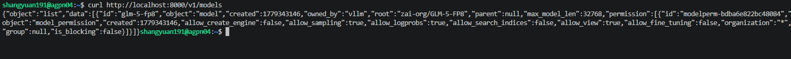
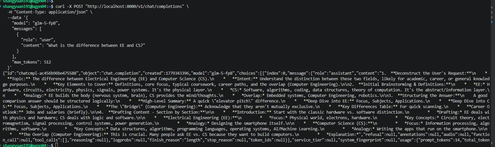

### Step 0 : 啟動docker環境
```bash
docker exec -it vllm-rocm-glm5 bash
```

### 用 vLLM ROCm + AITER enabled 來 serve。

### Step 1：先設環境變數

在 vllm-rocm-glm5 container 裡：

```bash
export VLLM_ROCM_USE_AITER=1
export VLLM_ROCM_USE_AITER_MLA=1
export VLLM_ROCM_USE_AITER_MOE=1
export VLLM_ROCM_USE_AITER_MHA=1
export VLLM_ROCM_USE_AITER_LINEAR=1
export VLLM_ROCM_USE_AITER_RMSNORM=1
export VLLM_ROCM_USE_AITER_FP8BMM=1
```

### Step 2 : 起一個vllm serve服務

```bash
vllm serve zai-org/GLM-5-FP8 \
   --host 0.0.0.0 \
   --port 8000 \
   --tensor-parallel-size 8 \
   --gpu-memory-utilization 0.9 \
   --max-model-len 32768 \
   --served-model-name glm-5-fp8 \
   --chat-template-content-format string
```


#### > Model loading took **91.31 GiB** memory

### Step 3 : 開另一個terminal 測curl:
```bash
curl http://localhost:8000/v1/models
```
結果如下:


```bash
{"object":"list","data":[{"id":"glm-5-fp8","object":"model","created":1779343146,"owned_by":"vllm","root":"zai-org/GLM-5-FP8","parent":null,"max_model_len":32768,"permission":[{"id":"modelperm-bdba6e822bc48084","object":"model_permission","created":1779343146,"allow_create_engine":false,"allow_sampling":true,"allow_logprobs":true,"allow_search_indices":false,"allow_view":true,"allow_fine_tuning":false,"organization":"*","group":null,"is_blocking":false}]}]}
```

再測一個:
```bash
curl -X POST "http://localhost:8000/v1/chat/completions" \
  -H "Content-Type: application/json" \
  --data '{
    "model": "glm-5-fp8",
    "messages": [
      {
        "role": "user",
        "content": "What is the difference between EE and CS?"
      }
    ],
    "max_tokens": 512 
  }'
```

跑出:




```bash
{"id":"chatcmpl-ac456b96be475588","object":"chat.completion","created":1779343396,"model":"glm-5-fp8","choices":[{"index":0,"message":{"role":"assistant","content":"1.  **Deconstruct the User's Request:**\n    *   **Topic:** The difference between Electrical Engineering (EE) and Computer Science (CS).\n    *   **Intent:** Understand the distinction between these two fields, likely for academic, career, or general knowledge purposes.\n    *   **Key Elements to Cover:** Definitions, core focus, typical coursework, career paths, and the overlap (Computer Engineering).\n\n2.  **Initial Brainstorming & Definitions:**\n    *   *EE:* Hardware, circuits, electricity, physics, signals, power systems. It's the physical layer.\n    *   *CS:* Software, algorithms, coding, data structures, theory of computation. It's the abstract/information layer.\n    *   *Analogy:* EE builds the body (nervous system, brain), CS provides the mind/thoughts.\n    *   *Overlap:* Embedded systems, Computer Engineering, robotics.\n\n3.  **Structuring the Answer:**\n    A good comparison answer should be structured logically:\n    *   **High-Level Summary:** A quick \"elevator pitch\" difference.\n    *   **Deep Dive into EE:** Focus, Subjects, Applications.\n    *   **Deep Dive into CS:** Focus, Subjects, Applications.\n    *   **The \"Bridge\" (Computer Engineering):** Acknowledge that they aren't mutually exclusive.\n    *   **Key Differences Table:** For quick scanning.\n    *   **Career Outlook:** Jobs and salaries (briefly).\n\n4.  **Drafting Content - Section by Section:**\n\n    *   **Introduction:** Start with the classic hardware vs. software distinction.\n        *   *Drafting:* EE deals with physics and hardware; CS deals with logic and software.\n\n    *   **Electrical Engineering (EE):**\n        *   *Focus:* Physical world, electrons, hardware.\n        *   *Key Concepts:* Circuit theory, electromagnetism, signal processing, control systems, power generation.\n        *   *Analogy:* Designing the smartphone itself.\n\n    *   **Computer Science (CS):**\n        *   *Focus:* Information processing, algorithms, software.\n        *   *Key Concepts:* Data structures, algorithms, programming languages, operating systems, AI/Machine Learning.\n        *   *Analogy:* Writing the apps that run on the smartphone.\n\n    *   **The Overlap (Computer Engineering):** This is crucial. Many people ask EE vs. CS because they want to build computers.\n        *   *Explanation:*","refusal":null,"annotations":null,"audio":null,"function_call":null,"tool_calls":[],"reasoning":null},"logprobs":null,"finish_reason":"length","stop_reason":null,"token_ids":null}],"service_tier":null,"system_fingerprint":null,"usage":{"prompt_tokens":14,"total_tokens":526,"completion_tokens":512,"prompt_tokens_details":null},"prompt_logprobs":null,"prompt_token_ids":null,"kv_transfer_params":null}
```


## 實驗設置
### 實驗A : Prefix / Prefill-heavy benchmark
```bash
--num-requests 256
--input-chars 16000
--max-tokens 128
--max-model-len 32768
```
理由: input_chars=16000 大約是 4K tokens 級別，足夠讓 prefix cache、TTFT、prefill 成本有明顯差異；max_tokens=128 避免 decode 太長蓋掉 prefill/prefix cache 的效果。

指令:
```bash
python3 run_full_pipeline.py \
  --vllm-server http://localhost:8000 \
  --model glm-5-fp8 \
  --concurrency-levels 1 2 4 8 16 32 64 \
  --prefix-overlaps 0.0 0.25 0.5 0.75 1.0 \
  --num-requests 256 \
  --warmup-requests 8 \
  --input-chars 16000 \
  --max-tokens 128 \
  --sample-gpu-mem

```

### 實驗B : Decode-throughput benchmark
```bash
--num-requests 256
--input-chars 4000
--max-tokens 1024
--max-model-len 32768
```
decode-heavy workload

指令:
```bash
python3 run_full_pipeline.py \
  --vllm-server http://localhost:8000 \
  --model glm-5-fp8 \
  --concurrency-levels 1 2 4 8 16 32 64 \
  --prefix-overlaps 0.0 \
  --num-requests 256 \
  --warmup-requests 8 \
  --input-chars 4000 \
  --max-tokens 1024 \
  --sample-gpu-mem
```


#### note : 提高max-model-len會壓縮可容納的並發 request 數
* 32768	較穩，適合 concurrency sweep
* 65536	可測 long-context，但 concurrency 要降
* 131072+	長上下文壓測，不適合 c=64 sweep


### insight:
#### 實驗A:
1. Prefix overlap 對 throughput 的影響非常巨大
2. overlap=1.0 並沒有永遠最佳 throughput
3. TTFT 對 overlap 極度敏感
4. Prefix hit 在高 concurrency 下降

#### 實驗B:
1. Throughput scaling 更線性
2. Decode latency 惡化明顯(隨著concurrency增高而惡化)
3. KV usage 大幅成長(隨著concurrency增高而成長)
4. Prefix overlap 對 decode-heavy workload 幫助有限


#### 會議記錄
1. concurrency往128 256甚至以上 去調整
2. throughput加單位
3. 可能需要給KV cache allocate 更多的空間
4. 把實驗數據改寫成"優化了多少比例的metric"
5. 這麼大的模型有辦法做PD分離嗎? (survey 究竟是把模型全重複製多份到不同的卡 每張卡做P or D?)
6. 實作PD分離(baseline是vllm serve)


