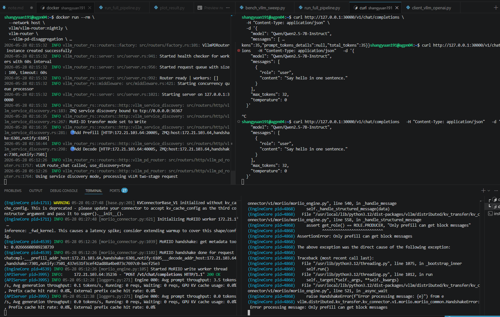
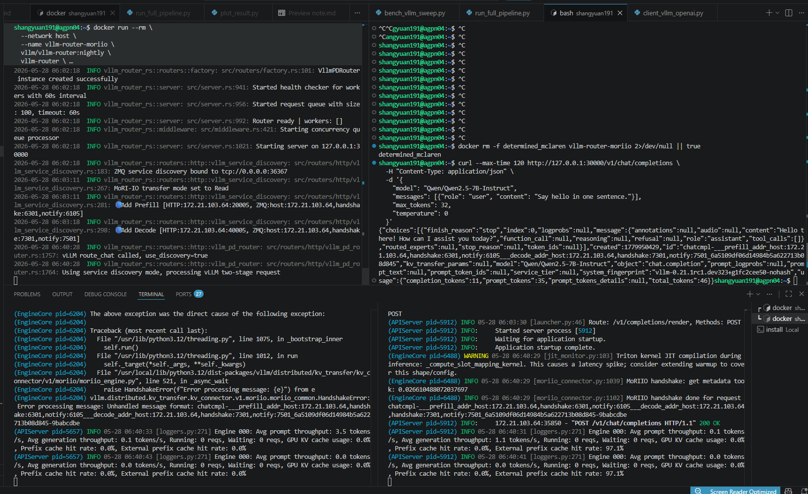

# PD Disaggregation


# vLLM PD Disaggregation + MoRIIO（Single-node MI300x）建置與除錯紀錄

## 目標（Goal）

使用以下元件完成 **Prefill–Decode (PD) disaggregation**：

- vLLM Router
- MoRIIO KV transfer
- Single-node AMD MI300x
- xGMI backend
- Router + Prefill + Decode 架構

最終目標：

- Router 成功啟動
- Prefill 與 Decode 成功被 Router 發現
- End-to-end `/v1/chat/completions` 可正常運作
- PD pipeline 驗證成功
- 驗證 multi-GPU / TP-aware PD configuration

---

## 環境（Environment）

硬體（Hardware）：

- AMD MI300x ×8
- Single node

軟體（Software）：

- ROCm
- vLLM router nightly
- vLLM OpenAI ROCm nightly
- MoRIIO connector

---

## 初始驗證（Initial Verification）

先確認環境是否具備基本元件：

```bash
python3 -c "import vllm; print(vllm.__version__)"
python3 -c "import mori; print('mori ok')"
python3 -c "import mori.io; print('mori.io ok')"
```

結果：

```text
mori ok
mori.io ok
```

確認 connector 可正常 import：

```python
import importlib

mods = [
    "vllm.distributed.kv_transfer.kv_connector.v1.moriio",
    "vllm.distributed.kv_transfer.kv_connector.v1.moriio.moriio_connector",
]
```

預期結果：

```text
MoRIIO is available
```

---

## 第一次嘗試（WRITE Mode）

架構：

```text
Router
→ Prefill (producer)
→ Decode (consumer)
```

初始配置：

- WRITE mode
- TP=4
- 兩個 7B service

Router：

```bash
docker run --network host \
  vllm/vllm-router:nightly \
  vllm-router \
  --vllm-pd-disaggregation \
  --kv-connector moriio \
  --vllm-discovery-address "0.0.0.0:36367"
```

---

## Failure #1 — Worker Initialization Failure

錯誤：

```text
WorkerProc initialization failed
```

### 問題診斷

檢查 GPU memory：

```bash
rocm-smi --showmeminfo vram
```

觀察到：

```text
193–194 GB already used
```

### Root Cause

原因：

- stale vLLM containers 尚未清理
- GPU 已被其他 container 佔用
- 導致當時誤以為 TP4 × 2 無法啟動

### 解法

採取：

- 移除舊 container
- 明確隔離 GPU visibility
- 降低配置做最小化驗證

範例：

```bash
export HIP_VISIBLE_DEVICES=0
export CUDA_VISIBLE_DEVICES=0
```

---

## Failure #2 — MoRIIO RDMA Assertion

錯誤：

```text
availDevices.size() > 0
```

### Root Cause

原因：

Stable v0.20.2 尚未支援 xGMI backend。

需要：

```json
"backend":"xgmi"
```

### 解法

改用：

```text
vllm/vllm-openai-rocm:nightly
```

透過：

```python
print(inspect.getsource(moriio_connector.MoRIIOConfig))
```

確認 nightly 新增：

```python
backend: str = "rdma"
```

與：

```python
backend = extra_config.get("backend","rdma")
```

代表：

nightly 已正式支援：

- rdma
- xgmi

backend。

---

## Failure #3 — transfer_mode mismatch

當時嘗試：

僅將 Decode 改為 READ mode。

Router 出現：

```text
expected Write, got Read
```

### 問題意義

代表：

Router 會鎖定 transfer mode。

以下混合模式：

- Prefill = WRITE
- Decode = READ

是不合法的。

### 重要結論

所有 worker 必須使用：

**相同 transfer mode**。

---

## Failure #4 — "Only prefill can get block messages"

在 WRITE mode 下出現：

```text
Only prefill can get block messages
```

### 現象

觀察到：

- Router 已進入 PD path
- curl 無回應
- Decode background thread crash

Router：

```text
Using service discovery mode, processing vLLM two-stage request
```

Decode：

```text
Only prefill can get block messages
```

### 推測原因

高度懷疑：

Nightly MoRIIO 與 WRITE mode 的 interaction 問題。

---

## 成功配置 #1 — 1P1D READ Mode

### 關鍵修改

所有元件統一：

```text
READ mode
```

Router：

```bash
docker run --rm \
  --network host \
  --name vllm-router-moriio \
  vllm/vllm-router:nightly \
  vllm-router \
  --vllm-pd-disaggregation \
  --kv-connector moriio \
  --vllm-discovery-address "0.0.0.0:36367"
```

### Prefill（1P）

GPU0：

```bash
export VLLM_ROCM_USE_AITER=1
export HIP_VISIBLE_DEVICES=0
export CUDA_VISIBLE_DEVICES=0
export VLLM_ROCM_USE_AITER=1
export HIP_VISIBLE_DEVICES=0
export CUDA_VISIBLE_DEVICES=0

vllm serve Qwen/Qwen2.5-7B-Instruct \
  -tp 1 \
  --host 0.0.0.0 \
  --port 20005 \
  --gpu-memory-utilization 0.40 \
  --max-model-len 2048 \
  --kv-transfer-config '{
    "kv_connector": "MoRIIOConnector",
    "kv_role": "kv_producer",
    "kv_connector_extra_config": {
      "backend": "xgmi",
      "read_mode": true,
      "proxy_ip": "127.0.0.1",
      "proxy_ping_port": "36367",
      "http_port": "20005",
      "handshake_port": "6301",
      "notify_port": "6105"
    }
  }'
```

### Decode（1D）

GPU1：

```bash
export VLLM_ROCM_USE_AITER=1
export HIP_VISIBLE_DEVICES=1
export CUDA_VISIBLE_DEVICES=1
export VLLM_ROCM_USE_AITER=1
export HIP_VISIBLE_DEVICES=1
export CUDA_VISIBLE_DEVICES=1

vllm serve Qwen/Qwen2.5-7B-Instruct \
  -tp 1 \
  --host 0.0.0.0 \
  --port 40005 \
  --gpu-memory-utilization 0.40 \
  --max-model-len 2048 \
  --kv-transfer-config '{
    "kv_connector": "MoRIIOConnector",
    "kv_role": "kv_consumer",
    "kv_connector_extra_config": {
      "backend": "xgmi",
      "read_mode": true,
      "proxy_ip": "127.0.0.1",
      "proxy_ping_port": "36367",
      "http_port": "40005",
      "handshake_port": "7301",
      "notify_port": "7501"
    }
  }'
```

### Client curl
```bash
curl --max-time 120 http://127.0.0.1:30000/v1/chat/completions \
  -H "Content-Type: application/json" \
  -d '{
    "model": "Qwen/Qwen2.5-7B-Instruct",
    "messages": [{"role": "user", "content": "Say hello in one sentence."}],
    "max_tokens": 32,
    "temperature": 0
  }'
```

結果：

- Router 發現 Prefill
- Router 發現 Decode
- curl E2E 成功
- READ mode 已驗證可運作

---

## Multi-GPU 驗證 — 4P4D READ Mode（最終成功配置）

在 1P1D 成功後，

重新驗證：

```text
4P4D
```

也就是：

- Prefill TP4
- Decode TP4
- 單機 8×MI300x
- xGMI + READ mode

此結果推翻了先前：

「TP4×2 無法啟動」

的早期假設。

實際 root cause 並非 TP4 限制，而是：

- stale GPU allocation
- stable image 不支援 xgmi
- WRITE mode 問題

---

## Router

```bash
docker run --rm \
  --network host \
  --name vllm-router-moriio \
  vllm/vllm-router:nightly \
  vllm-router \
  --vllm-pd-disaggregation \
  --kv-connector moriio \
  --vllm-discovery-address "0.0.0.0:36367"
```

---

## Prefill（4P）

GPU0–3：

```bash
export VLLM_ROCM_USE_AITER=1
export HIP_VISIBLE_DEVICES=0,1,2,3
export CUDA_VISIBLE_DEVICES=0,1,2,3
```

Serve：

```bash
vllm serve Qwen/Qwen2.5-7B-Instruct \
  -tp 4 \
  --host 0.0.0.0 \
  --port 20005 \
  --gpu-memory-utilization 0.40 \
  --max-model-len 2048 \
  --kv-transfer-config '{
    "kv_connector":"MoRIIOConnector",
    "kv_role":"kv_producer",
    "kv_connector_extra_config":{
      "backend":"xgmi",
      "read_mode":true,
      "proxy_ip":"127.0.0.1",
      "proxy_ping_port":"36367",
      "http_port":"20005",
      "handshake_port":"6301",
      "notify_port":"6105"
    }
  }'
```

---

## Decode（4D）

GPU4–7：

```bash
export VLLM_ROCM_USE_AITER=1
export HIP_VISIBLE_DEVICES=4,5,6,7
export CUDA_VISIBLE_DEVICES=4,5,6,7
```

Serve：

```bash
vllm serve Qwen/Qwen2.5-7B-Instruct \
  -tp 4 \
  --host 0.0.0.0 \
  --port 40005 \
  --gpu-memory-utilization 0.40 \
  --max-model-len 2048 \
  --kv-transfer-config '{
    "kv_connector":"MoRIIOConnector",
    "kv_role":"kv_consumer",
    "kv_connector_extra_config":{
      "backend":"xgmi",
      "read_mode":true,
      "proxy_ip":"127.0.0.1",
      "proxy_ping_port":"36367",
      "http_port":"40005",
      "handshake_port":"7301",
      "notify_port":"7501"
    }
  }'
```

---

## 4P4D 驗證結果（Validation）

Router：

```text
MoRI-IO transfer mode set to Read
Add Prefill
Add Decode
Using service discovery mode, processing vLLM two-stage request
```

curl：

```bash
curl --max-time 120 http://127.0.0.1:30000/v1/chat/completions \
-H "Content-Type: application/json" \
-d '{
"model":"Qwen/Qwen2.5-7B-Instruct",
"messages":[{"role":"user","content":"Say hello in one sentence."}],
"max_tokens":32,
"temperature":0
}'
```

Response：

```json
"finish_reason":"stop"
```

範例：

```json
"content":"Hello! How can I assist you today?"
```

Prefill logs：

```text
MoRIIO handshake done
POST /v1/chat/completions HTTP/1.1 200 OK
External prefix cache hit rate: 97.1%
```

此外：

TP-aware worker logs 顯示：

```text
Worker_TP0
Worker_TP1
Worker_TP2
Worker_TP3
```

皆成功完成：

```text
MoRIIO handshake done
```

代表：

MoRIIO multi-rank / TP-aware handshake

已在：

```text
4P4D + xgmi + READ mode
```

下成功驗證。

---

## Key Lessons（重要經驗）

1. xGMI 需要 nightly image
2. Stable image 不足以支援完整功能
3. Router 會鎖定 transfer mode
4. READ/WRITE 混用無效
5. WRITE mode 可能失敗
6. READ mode 已成功驗證
7. 4P4D 已成功驗證
8. Multi-rank MoRIIO handshake 可正常運作
9. 除錯第一步永遠是確認 GPU 是否被 stale allocation 佔用

---

## 建議可重複使用腳本（Suggested Reusable Scripts）

建議整理：

```text
start_router.sh
start_prefill_1p1d.sh
start_decode_1p1d.sh
start_prefill_4p.sh
start_decode_4d.sh
test_pd.sh
```

可讓後續：

- PD benchmarking
- LMCache / PD 比較
- 自動化 sweep

更加方便。


# vLLM PD Disaggregation Benchmarking（MI300x + MoRIIO + xGMI）

## 實驗目標（Goal）

本實驗旨在評估：

**Prefill–Decode (PD) disaggregation**

相較於：

**傳統 monolithic vLLM serving (baseline)**

在單機 AMD MI300x 環境下的效能差異。

比較重點：

1. Throughput
2. TTFT (Time To First Token)
3. ITL (Inter-Token Latency)
4. Decode latency
5. End-to-End latency
6. 不同 GPU resource allocation 下 PD 的行為

---

# 環境（Environment）

## Hardware

Single-node:

- AMD MI300x ×8

---

## Software

- ROCm
- vLLM router nightly
- vLLM OpenAI ROCm nightly
- MoRIIO connector
- xGMI backend
- AITER enabled

---

# Benchmark Workload

所有實驗使用相同 workload：

| Parameter | Value |
|---|---:|
| num_requests | 64 |
| concurrency | 16 |
| input_chars | 6000 |
| max_tokens | 64 |
| prompt type | shared-prefix |
| endpoint | `/v1/chat/completions` |

設計目的：

- Long prefill
- Moderate decode
- High prefix reuse
- 適合觀察 PD 與 prefix caching 行為

---

# Experiment 1 — Baseline TP4 (4 GPU)

傳統 vLLM serve：

```text
Monolithic serving
TP=4
```

GPU：

```text
GPU0–3
```

啟動：

```bash
export HIP_VISIBLE_DEVICES=0,1,2,3
export CUDA_VISIBLE_DEVICES=0,1,2,3

vllm serve Qwen/Qwen2.5-7B-Instruct \
  -tp 4 \
  --host 0.0.0.0 \
  --port 8000 \
  --gpu-memory-utilization 0.40 \
  --max-model-len 2048
```

---

# Experiment 2 — PD 4P4D (8 GPU)

PD 分離：

```text
4 Prefill GPUs
4 Decode GPUs
```

配置：

```text
Prefill TP4
Decode TP4
```

GPU：

| Stage | GPU |
|---|---|
| Prefill | 0–3 |
| Decode | 4–7 |

Router：

```text
MoRIIO
READ mode
xGMI backend
```

---

# Experiment 3 — PD 2P2D (4 GPU Fixed Budget)

為了公平比較：

總 GPU 數固定為：

```text
4 GPUs
```

PD 配置：

```text
2 Prefill GPUs
2 Decode GPUs
```

即：

```text
2P2D
```

GPU：

| Stage | GPU |
|---|---|
| Prefill | 0–1 |
| Decode | 2–3 |

目的：

評估：

> 在相同 GPU budget 下，PD 是否仍可優於 baseline？

---

# Results

---

# Baseline TP4 (4 GPU)

| Metric | Value |
|---|---:|
| Throughput | 56.96 req/s |
| TTFT mean | 0.191 s |
| TTFT p50 | 0.087 s |
| TTFT p90 | 0.575 s |
| TTFT p99 | 0.576 s |
| ITL mean | 3.89 ms |
| ITL p50 | 3.39 ms |
| ITL p90 | 4.69 ms |
| ITL p99 | 11.91 ms |
| Decode mean | 0.077 s |
| Decode p90 | 0.090 s |
| Decode p99 | 0.238 s |
| E2E mean | 0.269 s |
| E2E p50 | 0.164 s |
| E2E p90 | 0.637 s |
| E2E p99 | 0.638 s |

Prefix cache：

```text
97.7%
```

---

# PD 4P4D (8 GPU)

| Metric | Value |
|---|---:|
| Throughput | 50.08 req/s |
| TTFT mean | 0.249 s |
| TTFT p50 | 0.198 s |
| TTFT p90 | 0.538 s |
| TTFT p99 | 0.539 s |
| ITL mean | 2.78 ms |
| ITL p50 | 2.63 ms |
| ITL p90 | 3.47 ms |
| ITL p99 | 4.12 ms |
| Decode mean | 0.052 s |
| Decode p90 | 0.061 s |
| Decode p99 | 0.078 s |
| E2E mean | 0.300 s |
| E2E p50 | 0.249 s |
| E2E p90 | 0.594 s |
| E2E p99 | 0.595 s |

External prefix cache：

```text
96.6–97.1%
```

---

# PD 2P2D (4 GPU Fixed Budget)

| Metric | Value |
|---|---:|
| Throughput | 13.41 req/s |
| TTFT mean | 1.055 s |
| TTFT p50 | 0.212 s |
| TTFT p90 | 3.092 s |
| TTFT p99 | 3.092 s |
| ITL mean | 6.28 ms |
| ITL p50 | 3.80 ms |
| ITL p90 | 4.28 ms |
| ITL p99 | 50.60 ms |
| Decode mean | 0.119 s |
| Decode p50 | 0.072 s |
| Decode p90 | 0.076 s |
| Decode p99 | 0.971 s |
| E2E mean | 1.174 s |
| E2E p50 | 1.055 s |
| E2E p90 | 3.164 s |
| E2E p99 | 3.165 s |

---

# Comparison — Baseline vs 4P4D

## Throughput

| System | req/s |
|---|---:|
| Baseline TP4 | 56.96 |
| PD 4P4D | 50.08 |

Throughput 接近。

---

## Decode-side Latency

PD 4P4D 明顯改善：

| Metric | Baseline | 4P4D |
|---|---:|---:|
| ITL mean | 3.89ms | **2.78ms** |
| Decode mean | 77ms | **52ms** |
| Decode p99 | 238ms | **78ms** |

代表：

PD 有效降低：

- decode contention
- tail decode latency

---

## TTFT

TTFT 兩者接近：

| Metric | Baseline | 4P4D |
|---|---:|---:|
| p90 | 0.575 | 0.538 |
| p99 | 0.576 | 0.539 |

代表：

Prefill side 並未形成 bottleneck。

---

# Comparison — Baseline vs 2P2D

這是：

```text
Fixed GPU budget
```

公平比較。

---

## Throughput

| System | req/s |
|---|---:|
| Baseline TP4 | **56.96** |
| PD 2P2D | 13.41 |

Baseline 約：

```text
4.25× faster
```

---

## TTFT

差距極大：

| Metric | Baseline | 2P2D |
|---|---:|---:|
| mean | 0.191 | 1.055 |
| p90 | 0.575 | 3.092 |
| p99 | 0.576 | 3.092 |

代表：

2P2D 出現：

- Prefill bottleneck
- queueing
- TTFT explosion

---

## E2E

| Metric | Baseline | 2P2D |
|---|---:|---:|
| mean | 0.269 | 1.174 |
| p99 | 0.638 | 3.165 |

2P2D 明顯退化。

---

# Why 2P2D Lost

Workload：

```text
6000-char prompt
64-token generation
```

屬於：

```text
Long prefill
Short decode
```

2P2D：

```text
Prefill = 2 GPU
Decode = 2 GPU
```

但 baseline：

```text
4 GPU all serve prefill together
```

因此：

PD 將 GPU 一分為二後，

Prefill compute capacity：

```text
下降 50%
```

導致：

- queueing
- TTFT explosion
- throughput collapse

因此：

> PD 並非免費加速，若 resource partition 不合理，可能反而退化。

---

# TP Divisibility Issue

曾嘗試：

```bash
-tp 8
```

失敗：

```text
Total number of attention heads (28)
must be divisible by tensor parallel size (8)
```

原因：

Qwen2.5-7B：

```text
num_attention_heads = 28
```

vLLM 要求：

```text
num_heads % TP == 0
```

即：

```text
28 % TP == 0
```

合法：

```text
TP=1
TP=2
TP=4
TP=7
TP=14
TP=28
```

不合法：

```text
TP=3
TP=5
TP=8
```

因此：

```text
28 % 8 != 0
```

無法使用：

```text
TP8 baseline
```

---

# Key Insights

1.

PD 能改善：

- decode-side contention
- ITL
- decode p99

---

2.

PD 並不保證 throughput 一定提升。

其效果高度依賴：

- resource allocation
- workload shape

---

3.

在：

```text
fixed GPU budget
```

下，

若：

```text
prefill GPU 不足
```

則：

TTFT 會成為 bottleneck。

---

4.

4P4D 證明：

PD + xGMI + MoRIIO

可於：

```text
single-node MI300x
```

穩定運作。

---

# Final Takeaway

PD disaggregation 的核心價值並非：

> 永遠比 monolithic 更快

而是：

> 能夠透過 prefill/decode 資源解耦與獨立 scaling，改善 contention 與 tail latency。

但：

PD 是否優於 baseline，

取決於：

- workload shape
- prefill/decode ratio
- GPU resource allocation
- transfer overhead
- KV routing strategy

因此：

PD 是：

```text
resource scheduling optimization
```

而非：

```text
free speedup
```

