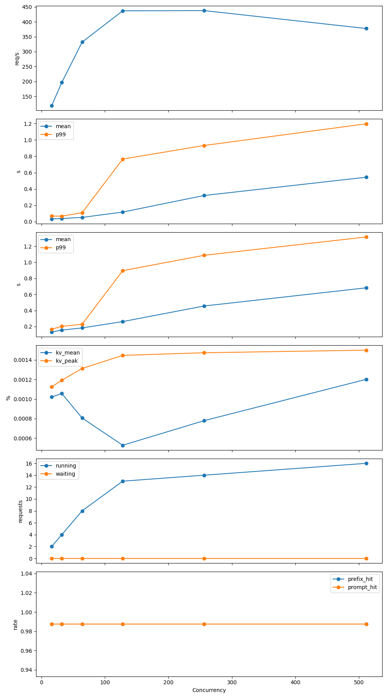
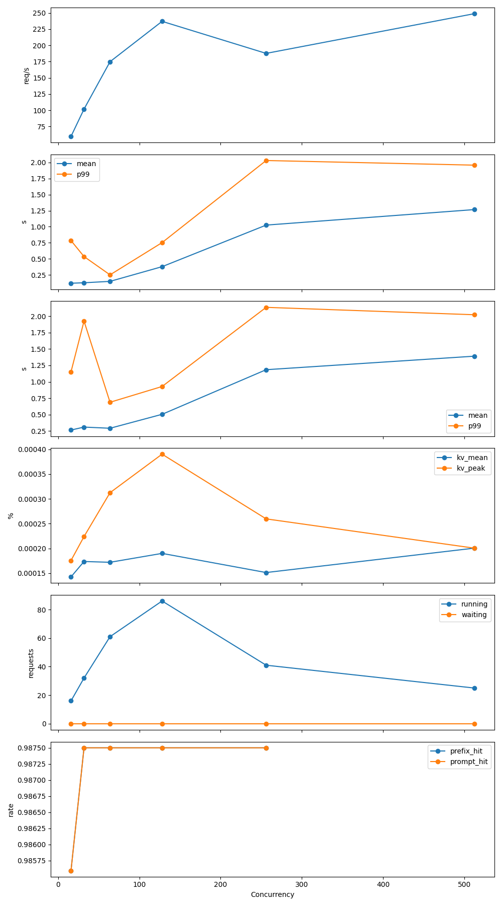

# NCHC PD Disaggregation 進度紀錄
日期：2026-06-04

---

# 目標

針對 vLLM PD Disaggregation 實驗環境進行建置與驗證，確認：

- MoRIIO KV Transfer 可用
- xGMI Backend 可用
- ROCm 環境正常
- 模型適合作為 PD Benchmark
- 可支援 Single-card Baseline 與 PD 架構比較

---

# 模型選型

最終選擇：

```text
meta-llama/Llama-3.1-8B-Instruct
```

選擇原因：

- 2024 年較新的模型
- vLLM 官方支援成熟
- ROCm 支援成熟
- 模型大小適合單張 MI300X 載入
- 適合後續 Single Instance 與 PD Benchmark 比較
- 社群 benchmark 資料較多

---

# 模型規格確認

來源：

```text
Hugging Face
→ Files and versions
→ config.json
```

重要參數：

```json
{
  "hidden_size": 4096,
  "max_position_embeddings": 131072,
  "num_attention_heads": 32,
  "num_hidden_layers": 32,
  "num_key_value_heads": 8,
  "torch_dtype": "bfloat16"
}
```

整理如下：

| 項目 | 數值 |
|--------|--------|
| Hidden Size | 4096 |
| Layers | 32 |
| Attention Heads | 32 |
| KV Heads | 8 |
| Context Length | 128K |
| DType | BF16 |

---

# TP=8 相容性檢查

PD 與後續實驗可能使用：

```text
TP = 8
```

檢查：

```text
32 % 8 = 0
```

結果：

```text
TP=8 完全相容
```

結論：

```text
Llama-3.1-8B-Instruct 適合作為 PD 實驗模型
```

---

# Docker 環境確認

目前使用：

```text
Container:
vllm-pd-moriio

Image:
vllm/vllm-openai-rocm:nightly
```

---

# 為何不使用 v0.20.2

先前使用：

```text
vllm/vllm-openai-rocm:v0.20.2
```

進行 MoRIIO 測試時出現：

```text
availDevices.size() > 0
```

原因：

```text
Stable v0.20.2 尚未完整支援 xGMI backend
```

PD + MoRIIO 需要：

```json
{
  "backend": "xgmi"
}
```

因此改用：

```text
vllm/vllm-openai-rocm:nightly
```

---

# ROCm 環境驗證

指令：

```bash
rocm-smi
```

結果：

```text
MI300X × 8 可見
```

---

# PyTorch 驗證

指令：

```bash
python3 -c "import torch; print(torch.cuda.is_available()); print(torch.cuda.device_count())"
```

結果：

```text
True
8
```

確認：

```text
ROCm 正常
PyTorch 正常
8 張 GPU 正常偵測
```

---

# vLLM 版本確認

指令：

```bash
python3 -c "import vllm; print(vllm.__version__)"
```

結果：

```text
0.21.1rc1.dev323+g1fc2cee50
```

確認：

```text
Nightly 版本正常
```

---

# Hugging Face 登入

設定：

```bash
export HF_HOME=/app/model
```

登入：

```bash
hf auth login
```

驗證：

```bash
hf auth whoami
```

結果：

```text
SkylerChuang
```

確認：

```text
HF Token 正常
```

---

# Gated Model 權限驗證

下載測試：

```bash
hf download meta-llama/Llama-3.1-8B-Instruct config.json
```

```bash
hf download meta-llama/Llama-3.1-8B-Instruct tokenizer.json
```

結果：

```text
下載成功
```

確認：

```text
Llama Access 已開通
HF Token 正常
Container 可存取模型
```

---

# Single GPU Smoke Test

使用 GPU0：

```bash
export HF_HOME=/app/model
export HIP_VISIBLE_DEVICES=0
```

啟動 vLLM：

```bash
vllm serve meta-llama/Llama-3.1-8B-Instruct \
    --host 0.0.0.0 \
    --port 8000 \
    --tensor-parallel-size 1 \
    --dtype bfloat16 \
    --max-model-len 8192 \
    --gpu-memory-utilization 0.85
```

Log：

```text
Resolved architecture: LlamaForCausalLM
Starting to load model...
Application startup complete.
```

確認：

```text
單卡載入成功
```

---

# API 測試

測試指令：

```bash
curl http://localhost:8000/v1/chat/completions \
  -H "Content-Type: application/json" \
  -d '{
    "model": "meta-llama/Llama-3.1-8B-Instruct",
    "messages": [
      {
        "role": "user",
        "content": "Say hello in one sentence."
      }
    ],
    "max_tokens": 32
  }'
```

回傳：

```json
{
  "content": "Hello, how can I assist you today?"
}
```

確認：

```text
Inference 成功
OpenAI-Compatible API 正常
```

---

# Milestone 1 完成

已驗證：

- Hugging Face 權限
- Gated Model 存取
- ROCm 環境
- MI300X GPU
- vLLM Nightly
- Llama-3.1-8B-Instruct
- Single GPU Load
- Single GPU Inference
- OpenAI API Serving

結論：

```text
Llama-3.1-8B-Instruct
+
vLLM Nightly
+
ROCm
+
MI300X

Single-card Baseline 驗證成功
```

---

# 下一步：Milestone 2

建立 Mentor 要求的 Baseline：

## 4 Independent Instances

配置：

```text
GPU0 → Port 8000
GPU1 → Port 8001
GPU2 → Port 8002
GPU3 → Port 8003
```

每張 GPU：

```text
各自載入完整 Llama-3.1-8B-Instruct
```

目的：

```text
4 Independent Instances
VS
2P2D PD Disaggregation
```

後續比較指標：

- Throughput
- TTFT
- Decode Latency
- GPU Utilization
- KV Cache Usage
- Prefix Cache Hit Rate


# Milestone 2：4 Independent vLLM Instances Baseline

## 實驗目的

根據 Mentor 建議，建立：

```text
Single-card Instance Baseline
```

作為後續：

```text
2P2D PD Disaggregation
```

的比較基準。

此階段不使用：

- PD Disaggregation
- MoRIIO KV Transfer
- Router Service
- KV Cache Sharing

而是讓每張 GPU 各自載入完整模型並獨立提供推論服務。

---

# 實驗環境

## Hardware

```text
AMD MI300X × 8
```

## Container Image

```text
vllm/vllm-openai-rocm:nightly
```

## vLLM Version

```text
0.21.1rc1.dev323+g1fc2cee50
```

## Model

```text
meta-llama/Llama-3.1-8B-Instruct
```

模型規格：

| 項目 | 數值 |
|--------|--------|
| Hidden Size | 4096 |
| Layers | 32 |
| Attention Heads | 32 |
| KV Heads | 8 |
| Context Length | 131072 |
| DType | BF16 |

確認：

```text
32 % 8 = 0
```

因此適合後續：

```text
TP=8
PD Benchmark
```

---

# Docker Compose 架構

## GPU 配置

```text
GPU0 → Port 8000
GPU1 → Port 8001
GPU2 → Port 8002
GPU3 → Port 8003
```

每張 GPU：

```text
TP = 1
Load 完整 Llama-3.1-8B-Instruct
```

架構如下：

```text
                    ┌─────────────┐
                    │ GPU0        │
                    │ vLLM #0     │
                    │ Port 8000   │
                    └──────┬──────┘
                           │

                    ┌──────▼──────┐
                    │ GPU1        │
                    │ vLLM #1     │
                    │ Port 8001   │
                    └──────┬──────┘
                           │

                    ┌──────▼──────┐
                    │ GPU2        │
                    │ vLLM #2     │
                    │ Port 8002   │
                    └──────┬──────┘
                           │

                    ┌──────▼──────┐
                    │ GPU3        │
                    │ vLLM #3     │
                    │ Port 8003   │
                    └─────────────┘
```

---

# 啟動流程

## 建立實驗目錄

```bash
mkdir -p ~/nchc-vllm-pd
cd ~/nchc-vllm-pd
```

## 建立 .env

```bash
cat > .env <<'EOF'
MODEL_NAME=meta-llama/Llama-3.1-8B-Instruct
HF_HOME=/app/model
HOST_HF_CACHE=./hf_cache
VLLM_IMAGE=vllm/vllm-openai-rocm:nightly
MAX_MODEL_LEN=8192
GPU_MEMORY_UTILIZATION=0.85
DTYPE=bfloat16
EOF
```

## 啟動 Docker Compose

```bash
docker compose -f compose/docker-compose.baseline.yml up -d
```

---

# Container 驗證

執行：

```bash
docker ps | grep vllm-llama31
```

結果：

```text
vllm-llama31-gpu0  Up
vllm-llama31-gpu1  Up
vllm-llama31-gpu2  Up
vllm-llama31-gpu3  Up
```

確認：

```text
4 個 vLLM Instance 成功啟動
```

---

# GPU 驗證

執行：

```bash
rocm-smi
```

結果：

```text
GPU0 VRAM 86%
GPU1 VRAM 86%
GPU2 VRAM 86%
GPU3 VRAM 86%

GPU4 VRAM 0%
GPU5 VRAM 0%
GPU6 VRAM 0%
GPU7 VRAM 0%
```

確認：

```text
每張 GPU 成功載入完整模型
```

且：

```text
不存在 TP
不存在 PD
不存在 KV Sharing
```

符合 Baseline 設計。

---

# API 測試

測試：

```bash
for port in 8000 8001 8002 8003; do
  echo "===== Testing port ${port} ====="
  curl http://localhost:${port}/v1/chat/completions \
    -H "Content-Type: application/json" \
    -d '{
      "model": "meta-llama/Llama-3.1-8B-Instruct",
      "messages": [
        {
          "role": "user",
          "content": "Say hello in one sentence."
        }
      ],
      "max_tokens": 32
    }'
  echo ""
done
```

測試 Prompt：

```text
Say hello in one sentence.
```

所有 Port 均成功回傳：

```json
{
  "content": "Hello, how can I assist you today?"
}
```

確認：

```text
Port 8000 正常
Port 8001 正常
Port 8002 正常
Port 8003 正常
```

---

# vLLM Runtime 資訊

單一 Instance Log：

```text
Model loading took 14.99 GiB memory
Available KV cache memory: 145.8 GiB
GPU KV cache size: 1,194,384 tokens
Maximum concurrency for 8,192 tokens/request: 145.80x
```

觀察：

- Llama-3.1-8B 僅使用約 15 GiB Model Weight
- MI300X 仍保留大量 KV Cache 空間
- 適合後續高 Concurrency Benchmark

---

# Milestone 2 結論

成功建立：

```text
4 Independent vLLM Instances Baseline
```

驗證內容：

- ✅ Docker Compose 啟動成功
- ✅ Llama-3.1-8B-Instruct 載入成功
- ✅ ROCm 正常
- ✅ MI300X 正常
- ✅ GPU0~GPU3 各自載入完整模型
- ✅ OpenAI-Compatible API 正常
- ✅ 四個 Endpoint 可獨立推論

---
# Independent 8-GPU Round-Robin Baseline Benchmark

Date: 2026-06-04

Author: Shang-Yuan Chuang

---

# Objective

建立 Multi-Instance vLLM Baseline。

比較未來：

- TP8 Monolithic Serving
- Independent Multi-Instance Serving
- PD Disaggregation
- LMCache
- MoRIIO KV Sharing

之前的效能差異。

本次實驗採用：

- 8 張 AMD GPU
- 每張 GPU 啟動一個獨立 vLLM instance
- Client-side Round Robin Load Balancing
- OpenAI Compatible API

架構如下：

```text
                    ┌────────────┐
                    │ Benchmark  │
                    │   Client   │
                    └──────┬─────┘
                           │
                Round Robin Dispatch
                           │
 ┌─────────┬─────────┬─────────┬─────────┬─────────┬─────────┬─────────┬─────────┐
 │         │         │         │         │         │         │         │         │
 ▼         ▼         ▼         ▼         ▼         ▼         ▼         ▼
8000      8001      8002      8003      8004      8005      8006      8007

GPU0      GPU1      GPU2      GPU3      GPU4      GPU5      GPU6      GPU7

TP=1      TP=1      TP=1      TP=1      TP=1      TP=1      TP=1      TP=1
```

---

# Environment

## Hardware

AMD GPU x8

## Model

```text
meta-llama/Llama-3.1-8B-Instruct
```

## vLLM

```text
v0.21.1rc1.dev323
```

## Docker Image

```text
vllm/vllm-openai-rocm:nightly
```

---

# Step 1 — Verify Model Can Run

登入 HuggingFace：

```bash
export HF_HOME=/app/model

hf auth login
hf auth whoami
```

確認：

```text
user: SkylerChuang
```

下載測試：

```bash
hf download meta-llama/Llama-3.1-8B-Instruct config.json
```

---

# Step 2 — Single GPU Validation

測試 GPU0：

```bash
export HIP_VISIBLE_DEVICES=0

vllm serve meta-llama/Llama-3.1-8B-Instruct \
    --host 0.0.0.0 \
    --port 8000 \
    --tensor-parallel-size 1 \
    --dtype bfloat16 \
    --max-model-len 8192 \
    --gpu-memory-utilization 0.85
```

測試：

```bash
curl http://localhost:8000/v1/chat/completions \
  -H "Content-Type: application/json" \
  -d '{
    "model":"meta-llama/Llama-3.1-8B-Instruct",
    "messages":[
      {
        "role":"user",
        "content":"Say hello in one sentence."
      }
    ],
    "max_tokens":32
  }'
```

回傳：

```text
Hello, how can I assist you today?
```

確認模型可正常推論。

---

# Step 3 — Docker Compose Deployment

建立：

```text
compose/docker-compose.8gpu-rr.yml
```

啟動：

```bash
docker compose -f compose/docker-compose.8gpu-rr.yml up -d
```

確認：

```bash
docker ps | grep vllm-llama31
```

結果：

```text
vllm-llama31-gpu0
vllm-llama31-gpu1
vllm-llama31-gpu2
vllm-llama31-gpu3
vllm-llama31-gpu4
vllm-llama31-gpu5
vllm-llama31-gpu6
vllm-llama31-gpu7
```

共 8 個 instance。

---

# Step 4 — Verify Endpoints

測試：

```bash
for port in 8000 8001 8002 8003 8004 8005 8006 8007; do
  echo "===== Testing port ${port} ====="

  curl http://127.0.0.1:${port}/v1/chat/completions \
    -H "Content-Type: application/json" \
    -d '{
      "model":"meta-llama/Llama-3.1-8B-Instruct",
      "messages":[
        {
          "role":"user",
          "content":"Say hello in one sentence."
        }
      ],
      "max_tokens":32
    }'

  echo ""
done
```

結果：

```text
Port 8000 OK
Port 8001 OK
Port 8002 OK
Port 8003 OK
Port 8004 OK
Port 8005 OK
Port 8006 OK
Port 8007 OK
```

全部可正常回應。

---

# Step 5 — Benchmark Script Upgrade

原本：

```text
single endpoint only
```

升級為：

```text
multi-endpoint round robin
```

新增：

```bash
--urls
```

例如：

```bash
python3 scripts/quick_bench_openai.py \
  --urls \
    http://127.0.0.1:8000/v1/chat/completions \
    http://127.0.0.1:8001/v1/chat/completions \
    ...
    http://127.0.0.1:8007/v1/chat/completions
```

Client 以：

```python
url = urls[i % len(urls)]
```

做 Round Robin Dispatch。

---

# Step 6 — Metrics Collection Upgrade

新增：

```bash
--metrics-interval
```

例如：

```bash
--metrics-interval 0.2
```

每 0.2 秒抓取：

```text
vllm:kv_cache_usage_perc
vllm:num_requests_running
vllm:num_requests_waiting
vllm:gpu_cache_usage_perc
prefix cache metrics
```

並寫入：

```json
metrics_summary
```

---

# Step 7 — Automated Benchmark Script

建立：

```bash
run_independent_8gpu_rr_metrics.sh
```

執行：

```bash
bash scripts/run_independent_8gpu_rr_metrics.sh
```

自動跑：

```text
C16
C32
C64
C128
C256
C512
```

---

# Workload

Model:

```text
meta-llama/Llama-3.1-8B-Instruct
```

Prompt Length:

```text
6000 chars
```

Generation Length:

```text
64 tokens
```

Requests:

```text
512
```

Concurrency:

```text
16
32
64
128
256
512
```

---

# Benchmark Results


| C | Throughput(req/s) | Mean TTFT | P99 TTFT | Mean E2E | P99 E2E |
|----|----|----|----|----|----|
| 16 | 119.06 | 0.034 | 0.069 | 0.132 | 0.167 |
| 32 | 196.67 | 0.038 | 0.068 | 0.156 | 0.202 |
| 64 | 331.84 | 0.052 | 0.110 | 0.183 | 0.229 |
| 128 | 436.64 | 0.118 | 0.766 | 0.262 | 0.896 |
| 256 | 437.47 | 0.320 | 0.932 | 0.456 | 1.087 |
| 512 | 377.37 | 0.544 | 1.198 | 0.682 | 1.315 |

---

# Metrics Results

| C | KV Peak | Running Peak | Waiting Peak |
|----|----|----|----|
| 16 | 0.0011 | 2 | 0 |
| 32 | 0.0012 | 4 | 0 |
| 64 | 0.0013 | 8 | 0 |
| 128 | 0.0014 | 13 | 0 |
| 256 | 0.0015 | 14 | 0 |
| 512 | 0.0015 | 16 | 0 |

---

# Prefix Cache Metrics

所有實驗皆為：

```text
prefix_hit_rate = 0.9875
prompt_cache_hit_rate = 0.9875
```

原因：

```text
所有 request 使用相同 prompt
```

因此：

```text
Prefix Cache 幾乎完全命中
```

屬於：

```text
High Prefix Reuse Workload
```

---

# Insights

## 1. Throughput Scaling

Throughput 隨 concurrency 增加而提升：

```text
119
→ 197
→ 332
→ 437
```

最高：

```text
C256
437 req/s
```

---

## 2. Saturation Point

C128 與 C256 幾乎相同：

```text
436.64
vs
437.47
```

代表系統已接近飽和。

---

## 3. Overload Region

C512：

```text
377 req/s
```

反而下降。

代表：

```text
Overloaded
```

更多 request 只增加等待時間。

---

## 4. Latency Explosion

Mean TTFT：

```text
0.03s
→
0.54s
```

P99 TTFT：

```text
0.07s
→
1.20s
```

高 concurrency 明顯增加 tail latency。

---

## 5. KV Cache Not Bottleneck

KV Usage：

```text
~0.15%
```

非常低。

目前瓶頸並非 KV Cache。

---

# Conclusion

Independent 8-GPU Round-Robin Baseline 建立完成。

最佳區間：

```text
C128 ~ C256
```

下一步：

```text
Experiment 2

TP8 Monolithic vLLM

vs

Independent 8 GPU RR
```

作為後續：

- PD Disaggregation
- LMCache
- MoRIIO

的重要 baseline。


# TP8 Monolithic Baseline Benchmark

Date: 2026-06-04

Author: Shang-Yuan Chuang

---

# Objective

建立 TP8 Monolithic Serving Baseline。

比較：

- Independent 8 GPU Round Robin
- TP8 Monolithic vLLM

在相同硬體資源下的效能差異。

本次實驗採用：

- AMD GPU × 8
- 單一 vLLM instance
- Tensor Parallel Size = 8
- OpenAI Compatible API

架構如下：

```text
                 Benchmark Client
                        │
                        ▼
               ┌────────────────┐
               │ vLLM TP=8      │
               │ Port 8000      │
               └────────────────┘
                        │
      ┌─────────────────┼─────────────────┐
      ▼                 ▼                 ▼
    GPU0              GPU1             GPU2
      ...               ...              ...
      ▼                 ▼                 ▼
    GPU7
```

---

# Environment

## Hardware

AMD GPU × 8

## Model

```text
meta-llama/Llama-3.1-8B-Instruct
```

## vLLM

```text
v0.21.1rc1.dev323
```

## Docker Image

```text
vllm/vllm-openai-rocm:nightly
```

---

# Step 1 — Shutdown Independent RR Deployment

停止先前的 8 個獨立 instance：

```bash
docker compose -f compose/docker-compose.8gpu-rr.yml down
```

確認：

```bash
docker ps
```

應無任何 vLLM container。

---

# Step 2 — Create TP8 Deployment

建立：

```text
compose/docker-compose.tp8.yml
```

核心設定：

```yaml
HIP_VISIBLE_DEVICES: "0,1,2,3,4,5,6,7"

--tensor-parallel-size 8

--port 8000
```

啟動：

```bash
docker compose -f compose/docker-compose.tp8.yml up -d
```

---

# Step 3 — Verify Deployment

查看 Log：

```bash
docker logs -f vllm-llama31-tp8
```

確認出現：

```text
Application startup complete.
```

---

# Step 4 — Verify GPU Usage

查看：

```bash
rocm-smi
```

應看到：

```text
GPU0~GPU7
皆有 VRAM 使用
```

代表 TP8 已成功建立。

---

# Step 5 — Verify Endpoint

測試：

```bash
curl http://127.0.0.1:8000/v1/chat/completions \
  -H "Content-Type: application/json" \
  -d '{
    "model":"meta-llama/Llama-3.1-8B-Instruct",
    "messages":[
      {
        "role":"user",
        "content":"Say hello in one sentence."
      }
    ],
    "max_tokens":32
  }'
```

回傳：

```text
Hello, how can I assist you today?
```

表示 TP8 正常運作。

---

# Step 6 — Benchmark Configuration

Benchmark Script：

```text
scripts/quick_bench_openai.py
```

Metrics Sampling：

```text
0.2 sec
```

Workload：

| Parameter | Value |
|------------|------------|
| Model | Llama-3.1-8B-Instruct |
| Input Length | 6000 chars |
| Output Length | 64 tokens |
| Requests | 512 |
| Concurrency | 16 / 32 / 64 / 128 / 256 / 512 |

---

# Step 7 — Run Benchmark（Historical Reference）

這段是當時的 TP8 基準測試紀錄；目前整理後的 repo 沒有保留對應腳本。
如果要重現 TP8 版本，請依照上面的 `compose/docker-compose.tp8.yml` 與本段前面的設定重建環境。

```text
historical script: run_and_summarize_tp8_metrics.sh
```

自動測試：

```text
C16
C32
C64
C128
C256
C512
```

---

# Benchmark Results


| C | Throughput(req/s) | Mean TTFT | P99 TTFT | Mean E2E | P99 E2E |
|----|----:|----:|----:|----:|----:|
| 16 | 59.89 | 0.122 | 0.785 | 0.266 | 1.152 |
| 32 | 101.89 | 0.129 | 0.537 | 0.311 | 1.924 |
| 64 | 174.92 | 0.151 | 0.252 | 0.293 | 0.689 |
| 128 | 237.07 | 0.379 | 0.753 | 0.505 | 0.928 |
| 256 | 187.73 | 1.026 | 2.030 | 1.184 | 2.133 |
| 512 | 248.87 | 1.267 | 1.958 | 1.390 | 2.021 |

---

# Metrics Results

| C | KV Peak | Running Peak | Waiting Peak |
|----|----:|----:|----:|
| 16 | 0.0002 | 16 | 0 |
| 32 | 0.0002 | 32 | 0 |
| 64 | 0.0003 | 61 | 0 |
| 128 | 0.0004 | 86 | 0 |
| 256 | 0.0003 | 41 | 0 |
| 512 | 0.0002 | 25 | 0 |

---

# Prefix Cache Metrics

| C | Prefix Hit Rate |
|----|----:|
| 16 | 0.9856 |
| 32 | 0.9875 |
| 64 | 0.9875 |
| 128 | 0.9875 |
| 256 | 0.9875 |
| 512 | 0.9875 |
| 512 | None |

原因：

```text
所有 request 使用相同 prompt
```

因此：

```text
Prefix Cache 幾乎完全命中
```

---

# Comparison with Independent 8GPU RR

## Throughput

| C | Independent RR | TP8 |
|----|----:|----:|
| 16 | 119.06 | 59.89 |
| 32 | 196.67 | 101.89 |
| 64 | 331.84 | 174.92 |
| 128 | 436.64 | 237.07 |
| 256 | 437.47 | 187.73 |
| 512 | 377.37 | 248.87 |

---

## Throughput Ratio

Independent RR / TP8

| C | Ratio |
|----|----:|
| 16 | 1.99× |
| 32 | 1.93× |
| 64 | 1.90× |
| 128 | 1.84× |
| 256 | 2.33× |
| 512 | 1.52× |

---

# Key Findings

## 1. Independent RR Significantly Outperforms TP8

在所有 Concurrency 下：

```text
Independent RR > TP8
```

最佳差距：

```text
C256

437 req/s
vs
188 req/s
```

約：

```text
2.3×
```

---

## 2. TP Communication Overhead Dominates

Llama-3.1-8B 本身可單卡容納：

```text
≈15GB
```

因此：

```text
TP8 不具有 memory advantage
```

卻引入：

```text
AllReduce
AllGather
Cross-GPU Communication
```

造成額外開銷。

---

## 3. Saturation Appears Earlier

TP8：

```text
Peak throughput ≈ C128
```

之後開始下降。

---

## 4. Latency Degrades Rapidly

Mean TTFT：

```text
0.12s
→
1.27s
```

P99 TTFT：

```text
0.25~0.75s
→
2.03s
```

高 Concurrency 下明顯惡化。

---

## 5. KV Cache Not Bottleneck

KV Usage：

```text
< 0.04%
```

非常低。

目前瓶頸並非 KV Cache。

---

# Conclusion

對於：

```text
Llama-3.1-8B-Instruct
```

此類可單卡容納的小模型，

```text
Independent Multi-Instance Serving
```

明顯優於：

```text
TP8 Monolithic Serving
```

原因：

```text
Tensor Parallel Communication Overhead
>
Model Partition Benefit
```

因此：

```text
Scale-Out
>
Scale-Up
```

在本實驗條件下成立。

---

# Next Step

後續規劃：

```text
Experiment 3
PD Disaggregation

Experiment 4
PD + MoRIIO

Experiment 5
PD + LMCache
```

並使用：

```text
Qwen2.5-72B
GLM-5-FP8
```

等大型模型進行驗證。


# comment
- 以independent instance來做baseline
- sweep xPyD ex:3P5D, 4P4D, 5P3D
- 