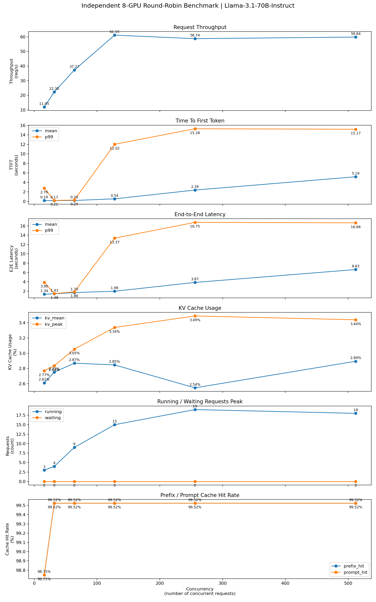
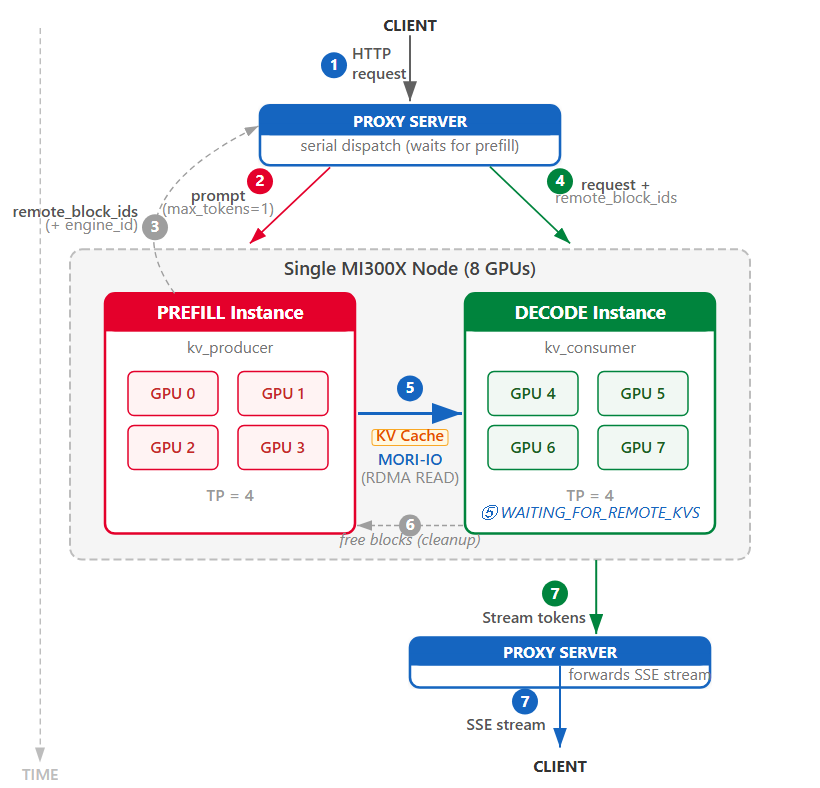

# NCHC PD Disaggregation 進度紀錄
日期：2026-06-11
### independent 8 GPU baseline
# Independent 8-GPU Round-Robin Baseline Benchmark（Llama-3.1-70B-Instruct）

## 實驗目的

建立後續 **4P4D（Prefill-Decode Disaggregation）** 實驗的比較基準（Baseline）。

---

## 實驗配置

### 模型

* Model：`meta-llama/Llama-3.1-70B-Instruct`
* Dtype：BF16
* Max Model Length：8192

### 硬體環境

* 8 × AMD MI300X
* 每張 GPU 獨立部署一個 vLLM Instance
* Tensor Parallel Size = 1
* GPU Memory Utilization = 0.85

### Serving 架構

* 8 個獨立 vLLM Server
* Client 端採用 Round-Robin 負載平衡

```text
Request Stream
      │
      ▼
Round-Robin Client
      │
 ┌────┼────┬────┬────┬────┬────┬────┬────┐
 ▼    ▼    ▼    ▼    ▼    ▼    ▼    ▼
GPU0 GPU1 GPU2 GPU3 GPU4 GPU5 GPU6 GPU7
 TP1  TP1  TP1  TP1  TP1  TP1  TP1  TP1
```

### Benchmark 參數

* Num Requests：1024
* Input Length：約 12000 chars
* Output Length：128 tokens
* Prefix Cache：Enabled
* Workload 類型：Shared Prefix

---


#### docker compose 啟用
```bash
docker compose -f compose/docker-compose.8gpu-rr.yml up -d
```

#### docker compose 停用
```bash
docker compose --env-file configs/.env -f compose/docker-compose.8gpu-rr.yml down
```
#### 確認docker有啟用
```bash
docker ps | grep vllm-llama31
```

#### 確認每個instance都開好
```bash
docker logs -f vllm-llama31-gpu0
docker logs -f vllm-llama31-gpu1
docker logs -f vllm-llama31-gpu2
docker logs -f vllm-llama31-gpu3
docker logs -f vllm-llama31-gpu4
docker logs -f vllm-llama31-gpu5
docker logs -f vllm-llama31-gpu6
docker logs -f vllm-llama31-gpu7
```

#### verify endpoints
```bash
for port in 8000 8001 8002 8003 8004 8005 8006 8007; do
  echo "===== Testing port ${port} ====="

  curl http://127.0.0.1:${port}/v1/chat/completions \
    -H "Content-Type: application/json" \
    -d '{
      "model":"meta-llama/Llama-3.1-70B-Instruct",
      "messages":[
        {
          "role":"user",
          "content":"Say hello in one sentence."
        }
      ],
      "max_tokens":32
    }'

  echo ""
done
```

#### 跑benchmark
```bash
bash scripts/run_and_summarize_independent_8gpu_rr_metrics.sh
```

### result




#### Benchmark 結果

| Concurrency | Throughput (req/s) | Mean TTFT (s) | P99 TTFT (s) | Mean E2E (s) | P99 E2E (s) |
| ----------- | -----------------: | ------------: | -----------: | -----------: | ----------: |
| 16          |              11.95 |        0.1855 |       2.7852 |       1.3369 |      3.8970 |
| 32          |              22.30 |        0.1689 |       0.2111 |       1.4310 |      1.4794 |
| 64          |              37.27 |        0.2043 |       0.2903 |       1.6997 |      1.8573 |
| 128         |              61.15 |        0.5434 |      12.0166 |       1.9772 |     13.3655 |
| 256         |              58.74 |        2.3887 |      15.2780 |       3.8684 |     16.7524 |
| 512         |              59.84 |        5.1858 |      15.1749 |       6.6330 |     16.6550 |

---

#### Decode 統計

| Concurrency | Mean Decode Time (s) | P99 Decode Time (s) | Mean ITL (s/token) | P99 ITL (s/token) |
| ----------- | -------------------: | ------------------: | -----------------: | ----------------: |
| 16          |               1.1514 |              1.1858 |             0.0384 |            0.0395 |
| 32          |               1.2620 |              1.3061 |             0.0421 |            0.0435 |
| 64          |               1.4954 |              1.6571 |             0.0499 |            0.0552 |
| 128         |               1.4338 |              1.5585 |             0.0478 |            0.0520 |
| 256         |               1.4798 |              1.6647 |             0.0494 |            0.0555 |
| 512         |               1.4472 |              1.7047 |             0.0483 |            0.0588 |

---

#### KV Cache 統計

| Concurrency | KV Cache Mean (%) | KV Cache Peak (%) |
| ----------- | ----------------: | ----------------: |
| 16          |              2.61 |              2.77 |
| 32          |              2.75 |              2.84 |
| 64          |              2.87 |              3.05 |
| 128         |              2.85 |              3.34 |
| 256         |              2.54 |              3.49 |
| 512         |              2.89 |              3.44 |

---

#### Scheduler 統計

| Concurrency | Running Peak | Waiting Peak |
| ----------- | -----------: | -----------: |
| 16          |            3 |            0 |
| 32          |            4 |            0 |
| 64          |            9 |            0 |
| 128         |           15 |            0 |
| 256         |           19 |            0 |
| 512         |           18 |            0 |

---

#### Prefix Cache 統計

| Concurrency | Prefix Hit Rate | Prompt Cache Hit Rate |
| ----------- | --------------: | --------------------: |
| 16          |          98.75% |                98.75% |
| 32          |          99.52% |                99.52% |
| 64          |          99.52% |                99.52% |
| 128         |          99.52% |                99.52% |
| 256         |          99.52% |                99.52% |
| 512         |          99.52% |                99.52% |

---

## 實驗觀察與分析

### 1. Throughput 呈現三個階段

#### 第一階段：近線性成長區（C=16~64）

Throughput 持續提升：

```text
11.95
→ 22.30
→ 37.27 req/s
```

此階段系統尚未達到飽和。

隨著 Concurrency 提升：

* GPU 利用率提高
* Continuous Batching 效果增加
* Batch Size 逐漸形成

因此 Throughput 幾乎隨負載增加而成長。

---

#### 第二階段：快速逼近飽和區（C=64~128）

```text
37.27
→ 61.15 req/s
```

此區間 Throughput 出現最大幅度提升。

代表 Scheduler 已能形成足夠大的 Decode Batch，使 GPU 計算效率接近最佳狀態。

---

#### 第三階段：飽和平台區（C≥128）

```text
61.15
→ 58.74
→ 59.84 req/s
```

當 Concurrency 繼續增加時：

* Throughput 幾乎不再提升
* 系統進入穩定飽和狀態

Peak Throughput 為：

```text
61.15 req/s
```

出現在：

```text
Concurrency = 128
```

---

### 2. 系統最佳工作點（Sweet Spot）

| Concurrency | Throughput |
| ----------- | ---------: |
| 128         |      61.15 |
| 256         |      58.74 |
| 512         |      59.84 |

可觀察到：

```text
C ≈ 128
```

已能達到最大 Throughput。

進一步提高負載：

* 不會提升吞吐量
* 只會增加排隊時間

因此：

```text
Sweet Spot ≈ C=128
```

可作為後續 PD 架構比較基準。

---

### 3. TTFT 出現明顯 Queueing Transition

Mean TTFT：

| Concurrency | Mean TTFT |
| ----------- | --------: |
| 16          |   0.186 s |
| 32          |   0.169 s |
| 64          |   0.204 s |
| 128         |   0.543 s |
| 256         |   2.389 s |
| 512         |   5.186 s |

可觀察到：

```text
C ≤ 64
```

時 TTFT 幾乎維持不變。

但：

```text
C ≥ 128
```

開始快速增加。

代表：

* GPU 已接近飽和
* 新 Request 開始等待 Scheduler
* Queueing Delay 成為 TTFT 的主要來源

---

### 4. P99 TTFT 發生 Tail Latency Explosion

P99 TTFT：

| Concurrency | P99 TTFT |
| ----------- | -------: |
| 64          |   0.29 s |
| 128         |  12.02 s |
| 256         |  15.28 s |
| 512         |  15.17 s |

從：

```text
0.29 s
```

直接跳升至：

```text
12.02 s
```

增加超過：

```text
41×
```

雖然 Mean TTFT 僅增加至：

```text
0.54 s
```

但部分 Request 已經需要等待十秒以上才能開始產生第一個 Token。

此現象為典型：

```text
Tail Latency Explosion
```

代表系統進入高負載區後，少數 Request 會遭遇極大的排隊延遲。

---

### 5. E2E Latency 與 TTFT 呈現一致趨勢

Mean E2E：

```text
1.34
→ 1.43
→ 1.70
→ 1.98
→ 3.87
→ 6.63 sec
```

P99 E2E：

```text
3.90
→ 1.48
→ 1.86
→ 13.37
→ 16.75
→ 16.66 sec
```

可發現：

E2E Latency 的增加趨勢與 TTFT 高度一致。

表示：

延遲增加主要來自：

```text
Request Waiting Time
```

而非：

```text
Decode Computation Time
```

---

### 6. Decode Time 幾乎維持穩定

Mean Decode Time：

| Concurrency | Decode Time |
| ----------- | ----------: |
| 16          |      1.15 s |
| 32          |      1.26 s |
| 64          |      1.50 s |
| 128         |      1.43 s |
| 256         |      1.48 s |
| 512         |      1.45 s |

可觀察到：

```text
≈ 1.4 ~ 1.5 sec
```

幾乎維持不變。

代表：

* Decode 計算成本固定
* GPU Decode 效率穩定
* Throughput Ceiling 主要由 Decode Compute 能力決定

因此：

```text
70B Decode FLOPs
```

才是系統的核心瓶頸。

---

### 7. Scheduler 已達穩定運作上限

Running Peak：

```text
3
4
9
15
19
18
```

Waiting Peak：

```text
0
0
0
0
0
0
```

可觀察到：

每個 vLLM instance 的 Active Sequence 數量僅維持在：

```text
約 15 ~ 20
```

左右。

即使外部 Concurrency 已達：

```text
512
```

Scheduler 仍維持穩定的 Batch 規模。

因此：

* Throughput 已達上限
* Decode Engine 已充分利用
* 再增加請求無法提升吞吐量

---

### 8. KV Cache 並非瓶頸

KV Cache Peak：

```text
2.77%
~ 3.49%
```

KV Cache Mean：

```text
2.54%
~ 2.89%
```

即使在最高負載下：

```text
KV Cache Usage < 4%
```

對於：

```text
8 × MI300X
```

而言仍遠低於記憶體上限。

因此：

系統目前受限於：

* Compute Throughput
* Decode Capacity
* Scheduler Efficiency

而非：

* KV Cache Capacity
* HBM Memory

---

### 9. Prefix Cache 幾乎完全命中

Prefix Hit Rate：

```text
98.75%
~ 99.52%
```

Prompt Cache Hit Rate：

```text
98.75%
~ 99.52%
```

原因為：

所有 Request 共用相同：

```text
12000-char Prompt
```

因此形成極高 Prefix Reuse。

本實驗代表：

```text
Shared-Prefix Best-Case Scenario
```

而非真實線上服務中的隨機 Prompt Workload。

---

## 結論

本次 Independent 8-GPU Round-Robin Baseline 的主要結論如下：

* Peak Throughput 為 61.15 req/s
* Sweet Spot 約位於 C=128
* 系統於 C≈128 開始進入飽和狀態
* Throughput Ceiling 由 Decode Compute 能力決定
* Mean TTFT 在高負載下快速增加
* P99 TTFT 出現明顯 Tail Latency Explosion（0.29s → 12.02s）
* Decode Time 維持約 1.4~1.5 秒，顯示 GPU Decode 效率穩定
* KV Cache 使用率始終低於 4%，並非瓶頸
* Prefix Cache Hit Rate 約 99.5%，屬於 Shared-Prefix 最佳情境

此結果將作為後續：

* 2P2D
* 4P4D
* READ Mode
* WRITE Mode
* Moriio KV Connector
* xPyD 拓樸

等實驗的比較基準（Baseline）。


### 4P4D

#### docker compose 啟用
```bash
docker compose --env-file configs/.env.4p4d -f compose/docker-compose.4p4d-read.yml up -d
```
會看到
```bash
[+] up 3/3

 ✔ Container vllm-router-moriio Created                                                                                                                                             0.1s 

 ✔ Container vllm-4p4d-decode   Created                                                                                                                                             0.0s 

 ✔ Container vllm-4p4d-prefill  Created 
 ```
#### docker compose 停用
```bash
docker compose --env-file configs/.env.4p4d -f compose/docker-compose.4p4d-read.yml down
```

#### 檢查三個docker內的狀況
```bash
docker logs -f vllm-router-moriio
docker logs -f vllm-4p4d-prefill
docker logs -f vllm-4p4d-decode   
```


#### verify endpoints
```bash
bash scripts/validate_4p4d_read.sh
```

#### 跑benchmark
```bash
bash scripts/run_and_summarize_4p4d_read_metrics.sh
```

#### Benchmark 結果

| Concurrency | Throughput (req/s) | Mean TTFT (s) | P99 TTFT (s) | Mean E2E (s) | P99 E2E (s) |
| ----------- | -----------------: | ------------: | -----------: | -----------: | ----------: |
| 16          |              23.78 |        0.2240 |       0.4628 |       0.6708 |      0.9071 |
| 32          |              32.73 |        0.4039 |       2.1139 |       0.9722 |      2.6630 |
| 64          |              47.89 |        0.5811 |       1.2051 |       1.3129 |      1.7514 |
| 128         |              54.53 |        1.3505 |       2.9128 |       2.2444 |      4.0791 |
| 256         |              56.67 |        3.1078 |       5.7406 |       4.0821 |      6.8707 |
| 512         |              56.56 |        6.2712 |      12.3785 |       7.1987 |     13.1395 |

---

#### Decode 統計

| Concurrency | Mean Decode Time (s) | P99 Decode Time (s) | Mean ITL (s/token) | P99 ITL (s/token) |
| ----------- | -------------------: | ------------------: | -----------------: | ----------------: |
| 16          |               0.4468 |              0.5401 |             0.0187 |            0.0213 |
| 32          |               0.5682 |              0.6881 |             0.0231 |            0.0275 |
| 64          |               0.7318 |              0.9949 |             0.0300 |            0.0394 |
| 128         |               0.8938 |              1.3081 |             0.0366 |            0.0543 |
| 256         |               0.9743 |              1.3490 |             0.0396 |            0.0552 |
| 512         |               0.9273 |              1.3244 |             0.0385 |            0.0546 |

---

#### KV Cache 統計

| Concurrency | KV Cache Mean (%) | KV Cache Peak (%) |
| ----------- | ----------------: | ----------------: |
| 16          |              9.57 |             19.47 |
| 32          |             10.08 |             20.47 |
| 64          |             10.61 |             21.48 |
| 128         |             11.15 |             22.48 |
| 256         |             11.66 |             23.49 |
| 512         |             12.16 |             24.50 |

---

#### Scheduler 統計

| Concurrency | Running Peak | Waiting Peak |
| ----------- | -----------: | -----------: |
| 16          |           16 |            0 |
| 32          |           32 |            0 |
| 64          |           64 |            0 |
| 128         |          100 |            0 |
| 256         |          100 |            0 |
| 512         |          100 |            0 |

---

#### Prefix Cache 統計

| Concurrency | Prefix Hit Rate | External Prefix Hit Rate | Prompt Cache Hit Rate |
| ----------- | --------------: | -----------------------: | --------------------: |
| 16          |          99.52% |                   45.83% |                99.74% |
| 32          |          99.52% |                   45.83% |                99.74% |
| 64          |          99.52% |                   45.83% |                99.74% |
| 128         |          99.52% |                   48.05% |                99.75% |
| 256         |          99.52% |                   48.10% |                99.75% |
| 512         |          99.52% |                   45.37% |                99.74% |


## 實驗觀察與分析

### 1. Throughput Scaling 與系統飽和行為

4P4D READ Mode 的 Throughput 隨 Concurrency 提升而持續增加：

| Concurrency | Throughput (req/s) |
| ----------- | -----------------: |
| 16          |              23.78 |
| 32          |              32.73 |
| 64          |              47.89 |
| 128         |              54.53 |
| 256         |              56.67 |
| 512         |              56.56 |

可觀察到 Throughput 在 C=16 至 C=128 之間持續成長，之後逐漸進入平台區。

Peak Throughput 為：

```text
56.67 req/s
```

出現在：

```text
Concurrency = 256
```

然而從 C=128 到 C=512：

```text
54.53
→ 56.67
→ 56.56 req/s
```

增幅已相當有限。

此結果顯示：

* 4P4D 架構仍具有良好的 Scaling 能力
* 系統於 C≈128 後逐漸達到飽和
* 增加外部請求數量已無法有效提升吞吐量

---

### 2. TTFT 呈現穩定且可預測的成長趨勢

Mean TTFT：

| Concurrency | Mean TTFT (s) |
| ----------- | ------------: |
| 16          |         0.224 |
| 32          |         0.404 |
| 64          |         0.581 |
| 128         |         1.351 |
| 256         |         3.108 |
| 512         |         6.271 |

與 Independent Baseline 相比，

4P4D 並未出現明顯的轉折點（Knee Point）。

TTFT 隨負載增加呈現較平滑的成長趨勢。

此結果表示：

* Prefill 與 Decode 已成功解耦
* Prefill 資源不再與 Decode 爭用 GPU 計算能力
* Scheduler 能夠維持較穩定的請求處理節奏

因此即使系統逐漸接近飽和，TTFT 仍維持可預期的增長模式。

---

### 3. Tail Latency 顯著改善

P99 TTFT：

| Concurrency | P99 TTFT (s) |
| ----------- | -----------: |
| 16          |        0.463 |
| 32          |        2.114 |
| 64          |        1.205 |
| 128         |        2.913 |
| 256         |        5.741 |
| 512         |       12.379 |

與 Independent Baseline 相比，

4P4D 並未出現極端的 Tail Latency Explosion。

例如：

| Concurrency | Independent |   4P4D |
| ----------- | ----------: | -----: |
| 128         |     12.02 s | 2.91 s |

P99 TTFT 降低約：

```text
75%
```

以上。

此結果說明：

PD Disaggregation 能有效降低部分請求因 Decode 資源競爭所造成的長時間等待。

因此在中高負載情境下，

4P4D 能提供更穩定的使用者體驗。

---

### 4. Decode Efficiency 顯著提升

Mean Decode Time：

| Concurrency | Decode Time (s) |
| ----------- | --------------: |
| 16          |           0.447 |
| 32          |           0.568 |
| 64          |           0.732 |
| 128         |           0.894 |
| 256         |           0.974 |
| 512         |           0.927 |

可觀察到：

```text
Decode Time < 1 sec
```

即使在高負載下仍維持穩定。

相較於 Independent Baseline：

| Concurrency | Independent |    4P4D |
| ----------- | ----------: | ------: |
| 128         |     1.434 s | 0.894 s |
| 256         |     1.480 s | 0.974 s |
| 512         |     1.447 s | 0.927 s |

Decode Time 降低約：

```text
35% ~ 40%
```

此結果證明：

TP4 Decode Engine 能夠更有效率地執行大型模型的 Decode 階段。

換言之，

PD 架構確實成功提升了 Decode Side 的計算效率。

---

### 5. KV Cache 利用率大幅提升

KV Cache Peak：

| Concurrency | KV Peak (%) |
| ----------- | ----------: |
| 16          |       19.47 |
| 32          |       20.47 |
| 64          |       21.48 |
| 128         |       22.48 |
| 256         |       23.49 |
| 512         |       24.50 |

可觀察到：

```text
KV Cache Usage ≈ 20% ~ 25%
```

遠高於 Independent Baseline：

```text
≈ 3%
```

此結果顯示：

* 請求被集中於單一 Decode Cluster
* KV Cache 得以被更多請求共享
* Cache Reuse 效果顯著增加

因此 PD 架構不僅影響計算資源配置，也改變了 KV Cache 的使用模式。

---

### 6. Scheduler 飽和點的出現

Running Peak：

| Concurrency | Running Peak |
| ----------- | -----------: |
| 16          |           16 |
| 32          |           32 |
| 64          |           64 |
| 128         |          100 |
| 256         |          100 |
| 512         |          100 |

可觀察到：

```text
Running Peak = 100
```

自 C=128 起即維持不變。

這代表 Decode Worker 的 Active Sequence Capacity 已達上限。

因此：

* Throughput 停止成長
* TTFT 持續增加
* E2E Latency 持續增加

形成典型的飽和行為。

此現象同時解釋了為何 Throughput 最終停留於：

```text
約 56 req/s
```

而未能持續成長。

---

### 7. Prefix Cache 與 External Prefix Cache

Prefix Hit Rate：

```text
99.52%
```

Prompt Cache Hit Rate：

```text
99.74%
```

皆維持極高水準。

此外：

External Prefix Hit Rate：

```text
約 46% ~ 48%
```

顯示約有一半的 Prefix Reuse 來自於外部 KV Transfer。

此結果證明：

* Moriio Connector 正常運作
* Read Mode KV Sharing 已成功生效
* PD 架構下的 KV Reuse 確實存在

因此本次實驗已成功驗證：

```text
Prefill → KV Transfer → Decode
```

完整資料流路徑。

---

## 結論

本次 4P4D READ Mode Benchmark 顯示：

* Peak Throughput 約為 56.7 req/s
* 系統於 C≈128 開始逐漸進入飽和
* Throughput 略低於 Independent Baseline
* TTFT 成長趨勢較為平滑
* P99 TTFT 顯著降低
* Decode Time 降低約 35%~40%
* KV Cache 利用率提升約 7~8 倍
* Running Peak 最終受限於 Decode Worker Capacity（100 Active Sequences）
* External Prefix Hit Rate 約 46%~48%，證實 Moriio Read Mode KV Sharing 生效

整體而言，

4P4D READ Mode 並未提升單機最大 Throughput，但成功改善了 Tail Latency、Decode Efficiency 與 KV Cache 利用率。

因此其主要價值在於提升系統延遲表現與資源利用效率，而非增加單機吞吐量上限。


## Comparison: Independent vs 4P4D READ

本節比較兩種部署架構：

* **Independent Serving**

  * 8 個獨立 vLLM Instance
  * 每張 GPU 載入完整 70B 模型
  * 每個 Instance 自行執行 Prefill 與 Decode

* **4P4D READ Mode**

  * Prefill TP=4
  * Decode TP=4
  * 透過 Moriio Connector 進行 KV Transfer
  * 採用 Read Mode KV Sharing

所有實驗皆使用相同條件：

* Model: Llama-3.1-70B-Instruct
* Prompt Length: 12000 chars
* Max Tokens: 128
* Requests: 1024
* Hardware: 8 × MI300X

---

### 1. Throughput Comparison

| Concurrency | Independent | 4P4D READ |
| ----------- | ----------: | --------: |
| 16          |       11.95 |     23.78 |
| 32          |       22.30 |     32.73 |
| 64          |       37.27 |     47.89 |
| 128         |       61.15 |     54.53 |
| 256         |       58.74 |     56.67 |
| 512         |       59.84 |     56.56 |

---

#### Low-Concurrency Region (C ≤ 64)

在低負載情況下，

4P4D 顯著優於 Independent。

例如：

| Concurrency | Throughput Gain |
| ----------- | --------------: |
| 16          |            +99% |
| 32          |            +47% |
| 64          |            +28% |

尤其在 C=16：

```text
11.95 req/s
→ 23.78 req/s
```

幾乎提升：

```text
2×
```

此結果顯示：

Prefill TP4 能有效降低長 Prompt 所造成的 Prefill 成本。

對於長輸入場景而言，

PD 架構在低負載下具有明顯優勢。

---

#### High-Concurrency Region (C ≥ 128)

當系統逐漸進入飽和區後：

| Concurrency | Independent |  4P4D |
| ----------- | ----------: | ----: |
| 128         |       61.15 | 54.53 |
| 256         |       58.74 | 56.67 |
| 512         |       59.84 | 56.56 |

Independent 開始反超。

Peak Throughput：

| Architecture | Peak TPS |
| ------------ | -------: |
| Independent  |    61.15 |
| 4P4D READ    |    56.67 |

差距約：

```text
7.3%
```

因此：

PD 並未提高單機最大吞吐量。

相反地，

其犧牲部分 Peak Throughput 換取更好的延遲表現。

---

### 2. TTFT Comparison

Mean TTFT：

| Concurrency | Independent |  4P4D |
| ----------- | ----------: | ----: |
| 16          |       0.186 | 0.224 |
| 32          |       0.169 | 0.404 |
| 64          |       0.204 | 0.581 |
| 128         |       0.543 | 1.351 |
| 256         |       2.389 | 3.108 |
| 512         |       5.186 | 6.271 |

若只觀察 Mean TTFT：

Independent 反而略優。

然而 Mean 無法反映使用者體驗的最差情況。

因此更重要的是觀察：

```text
P99 TTFT
```

---

### 3. Tail Latency Comparison

P99 TTFT：

| Concurrency | Independent |  4P4D |
| ----------- | ----------: | ----: |
| 16          |        2.79 |  0.46 |
| 32          |        0.21 |  2.11 |
| 64          |        0.29 |  1.21 |
| 128         |       12.02 |  2.91 |
| 256         |       15.28 |  5.74 |
| 512         |       15.17 | 12.38 |

最值得注意的是：

#### C=128

```text
Independent:
12.02 sec

4P4D:
2.91 sec
```

改善：

```text
75.8%
```

---

#### C=256

```text
Independent:
15.28 sec

4P4D:
5.74 sec
```

改善：

```text
62.4%
```

---

此結果表示：

4P4D 雖然沒有改善平均 TTFT，

卻大幅降低最慢使用者所遭遇的等待時間。

因此：

PD 架構最大的價值之一，

是改善 Tail Latency。

---

### 4. Decode Efficiency Comparison

Mean Decode Time：

| Concurrency | Independent | 4P4D |
| ----------- | ----------: | ---: |
| 16          |        1.15 | 0.45 |
| 32          |        1.26 | 0.57 |
| 64          |        1.50 | 0.73 |
| 128         |        1.43 | 0.89 |
| 256         |        1.48 | 0.97 |
| 512         |        1.45 | 0.93 |

在所有 Concurrency 下：

4P4D Decode Time 均明顯較低。

例如：

#### C=512

```text
1.45 sec
→ 0.93 sec
```

改善：

```text
35.9%
```

---

此結果證明：

TP4 Decode Engine 的計算效率高於：

```text
8 × TP1 Decode Engines
```

因此：

PD 架構成功提升了 Decode Side 的執行效率。

---

### 5. KV Cache Utilization Comparison

KV Cache Peak：

| Concurrency | Independent |   4P4D |
| ----------- | ----------: | -----: |
| 16          |       2.77% | 19.47% |
| 128         |       3.34% | 22.48% |
| 512         |       3.44% | 24.50% |

可觀察到：

```text
4P4D ≈ 7~8× Higher KV Cache Usage
```

原因為：

Independent：

* 每個 Instance 維護自己的 KV Cache
* Cache 被切分在 8 個獨立服務中

4P4D：

* 所有請求集中至單一 Decode Cluster
* KV Cache 得到更高的共享程度

因此：

PD 架構能顯著提高 KV Cache 利用率。

---

### 6. Scheduler Behavior Comparison

Running Peak：

| Concurrency | Independent | 4P4D |
| ----------- | ----------: | ---: |
| 128         |          15 |  100 |
| 256         |          19 |  100 |
| 512         |          18 |  100 |

Independent：

```text
≈ 15~20 active requests
```

4P4D：

```text
100 active requests
```

代表：

4P4D 的 Decode Worker 能維持更大的 Active Sequence Pool。

但同時也形成新的瓶頸：

```text
Running Peak = 100
```

最終限制了 Throughput Ceiling。

---

## Discussion

本實驗顯示：

PD Disaggregation 的主要價值並非提高單機最大 Throughput。

相反地，

其核心優勢體現在：

* 更高的 Decode Efficiency
* 更佳的 KV Cache Utilization
* 顯著降低 Tail Latency
* 更穩定的高負載表現

然而：

由於 Decode Side 最終仍集中於單一 TP4 Decode Cluster，

因此系統在高 Concurrency 下會受到 Decode Capacity 限制，

導致 Peak Throughput 略低於 Independent Serving。

換言之，

在單機 8×MI300X 環境中：

* **Independent 更適合作為吞吐量導向（Throughput-Oriented）部署**
* **4P4D 更適合作為延遲導向（Latency-Oriented）部署**

兩者反映的是不同的系統設計取捨（Trade-off）。

---

## Key Takeaways

* Independent 擁有較高 Peak Throughput（61.15 req/s）
* 4P4D 在低負載下可達近 2× Throughput 提升
* 4P4D Decode Time 降低約 35~40%
* 4P4D KV Cache Utilization 提升約 7~8 倍
* 4P4D 顯著改善 P99 TTFT
* 4P4D Throughput Ceiling 略低於 Independent
* PD 的主要收益來自延遲改善與資源利用率提升，而非最大吞吐量提升


# vLLM PD Benchmark 現況整理（2026-06）

## 實驗目標

目前正在 NCHC 的 8×AMD MI300X 單機環境上評估 vLLM 的 Prefill-Decode Disaggregation (PD) 架構，目標是研究不同 Prefill / Decode 資源配置對於：

* Throughput
* TTFT (Time To First Token)
* ITL (Inter-Token Latency)
* E2E Latency
* Goodput

之影響。

---

# 實驗環境

## Hardware

* 8 × AMD MI300X
* Single Node
* xGMI Enabled

## Software Stack

* vLLM Nightly (ROCm)
* MoRIIO KV Connector
* vllm-router
* Docker Compose
* xGMI KV Transfer Backend

## Model

* Llama-3.1-70B-Instruct

---

# 已完成實驗

## Baseline 1：8 Independent Serving

### 架構

每張 GPU 啟動一個獨立 vLLM Instance：

```text
GPU0 -> Full Model
GPU1 -> Full Model
GPU2 -> Full Model
GPU3 -> Full Model
GPU4 -> Full Model
GPU5 -> Full Model
GPU6 -> Full Model
GPU7 -> Full Model
```

每個 Instance：

* 載入完整模型權重
* 同時執行 Prefill 與 Decode

Request 經由 Round-Robin 分配：

```text
Request
↓
Load Balancer
↓
One Independent Instance
↓
Response
```

### 結果

實驗成功完成。

已作為主要 Baseline。

---

## Baseline 2：4P4D READ Mode

### 架構

Prefill Group：

```text
TP = 4
GPU0~GPU3
```

Decode Group：

```text
TP = 4
GPU4~GPU7
```

整體流程：

```text
Request
↓
Router
↓
Prefill TP4
↓
KV Transfer (MoRIIO)
↓
Decode TP4
↓
Response
```

### 結果

實驗成功完成。

已取得完整 Benchmark 數據。

---

# 遇到的問題

## 希望測試更多 P:D 比例

原始規劃：

```text
2P6D
3P5D
5P3D
6P2D
```

例如：

```text
Prefill TP2
Decode TP6
```

或：

```text
Prefill TP3
Decode TP5
```

藉此研究不同 Prefill / Decode 資源配置對效能的影響。

---

# TP Divisibility 問題

Llama-3.1-70B 的架構為：

```text
num_attention_heads = 64
num_key_value_heads = 8
```

vLLM 的 Tensor Parallelism 要求：

```text
attention heads
以及
KV heads

必須能被 TP size 整除
```

因此：

| TP Size | 是否支援 |
| ------- | ---- |
| TP=1    | ✅    |
| TP=2    | ✅    |
| TP=4    | ✅    |
| TP=8    | ✅    |
| TP=3    | ❌    |
| TP=5    | ❌    |
| TP=6    | ❌    |

結果：

```text
2P6D
3P5D
5P3D
6P2D
```

無法直接透過 TP-based PD 架構實現。

---

# 嘗試的替代方案

為了繞過 TP 限制，

改採：

## Full Model Instance 架構

所有 GPU 都載入完整模型。

以 2P6D 為例：

```text
P0
P1

D0
D1
D2
D3
D4
D5
```

總共：

```text
8 個獨立 vLLM Instance
8 份完整模型
```

概念上：

```text
Request
↓
Router
↓
One Prefill Instance
↓
KV Transfer
↓
One Decode Instance
↓
Response
```

---

# 新問題：KV Ownership Mismatch

此架構最終失敗。

觀察到的現象為：

```text
Prefill Instance A
產生 KV Cache
```

但 Router 之後可能將 Decode Request 分配給：

```text
Decode Instance B
```

而不是原本與其配對的 Decode Instance。

例如：

```text
P0
↓
KV
↓
D0
```

但 Router 最後可能路由到：

```text
D3
```

結果：

```text
D3 找不到對應 KV Cache
```

進而導致：

```text
KV Mismatch
Decode Failure
Instance Crash
```

---

# 目前推測

目前推測 Router 並未保證：

```text
Producer
↔
Consumer
```

之間的固定配對關係。

Router 的行為更接近：

```text
Dynamic Scheduling
```

而非：

```text
Sticky Routing
```

因此：

```text
KV Cache Ownership
無法被正確維護
```

---

# 目前理解的 vLLM PD 架構

目前觀察顯示，

vLLM PD + MoRIIO 較符合以下模式：

```text
One Prefill Group
↔
One Decode Group
```

例如：

```text
Prefill TP4
↔
Decode TP4
```

此模式已驗證可正常運作。

---

# 尚未確認的問題

## Q1

vllm-router 是否支援：

```text
Many Producers
↔
Many Consumers
```

拓撲？

---

## Q2

MoRIIO 是否支援：

```text
Many-to-Many KV Transfer
```

並正確維護 KV Ownership？

---

## Q3

目前失敗原因究竟是：

* Router Limitation
* MoRIIO Limitation
* Deployment Design Issue

還是三者皆有關聯？

---

## Q4

是否存在官方建議的方式來實現：

```text
2P6D
3P5D
5P3D
6P2D
```

而不受 TP Divisibility 限制？

---

# 目前結論

目前已成功完成：

```text
8 Independent Serving
```

以及：

```text
4P4D (TP4 ↔ TP4)
```

Benchmark。

對於：

```text
2P6D
3P5D
5P3D
6P2D
```

使用 TP-based 設計會受到：

```text
Attention Head Divisibility
```

限制。

改採：

```text
8 Full-Model Instances
```

雖可避開 TP 問題，

但又遭遇：

```text
KV Ownership
Producer-Consumer Pairing
Router Scheduling
```

相關問題。

因此目前傾向認為：

```text
4P4D TP4↔TP4
```

是目前最穩定且已驗證成功的 PD Benchmark 配置。

後續需要進一步確認：

* Router 的實際 Routing 機制
* MoRIIO 的拓撲支援能力
* 官方對 Many-Producer / Many-Consumer PD 的支援程度
* 是否存在更合理的 Benchmark Matrix 設計

```
```


#### TODO
* survey mooncake (PD connector)
* 測token throughput (而不是request)
* 將這幾個月的內容整理成gitlab repo

