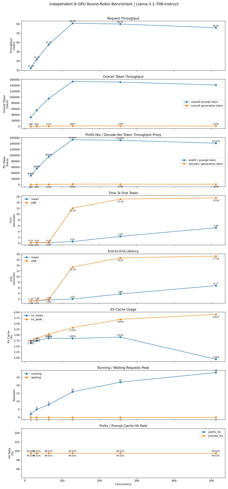

# NCHC PD Disaggregation 進度紀錄
日期：2026-06-18

# Independent 8-GPU Round-Robin Benchmark（Llama-3.1-70B-Instruct）

## Token Throughput

| Concurrency | Request Throughput (req/s) | Prompt Token Throughput (tok/s) | Generation Token Throughput (tok/s) | Total Token Throughput (tok/s) |
|------------:|---------------------------:|--------------------------------:|------------------------------------:|-------------------------------:|
| 16  | 12.26 | 30,942.90 | 367.78 | 31,310.69 |
| 32  | 21.79 | 54,988.51 | 652.12 | 55,640.63 |
| 64  | 37.75 | 95,288.97 | 1,132.00 | 96,420.97 |
| 128 | **60.78** | **153,411.06** | **1,823.19** | **155,234.25** |
| 256 | 60.01 | 151,466.53 | 1,798.73 | 153,265.27 |
| 512 | 56.05 | 141,472.38 | 1,677.80 | 143,150.18 |

> **註：**
>
> 在 Independent Serving 中，每個 vLLM instance 同時負責 **Prefill** 與 **Decode**。
> 因此：
>
> - Prompt Token Throughput 可視為 **Prefill Workload Throughput**
> - Generation Token Throughput 可視為 **Decode Workload Throughput**
>
> 這裡的 Prefill / Decode throughput 是 workload proxy，而非真正分離式 PD 架構中的 worker throughput。

---

## Latency

| Concurrency | Mean TTFT (s) | Mean E2E (s) | Mean Decode (s) | Mean ITL (s/token) |
|------------:|--------------:|-------------:|----------------:|-------------------:|
|16|0.153|1.304|1.151|0.0384|
|32|0.165|1.463|1.298|0.0434|
|64|0.206|1.679|1.473|0.0491|
|128|0.574|2.020|1.446|0.0482|
|256|2.351|3.805|1.454|0.0485|
|512|5.299|6.768|1.469|0.0491|

---

# Benchmark Insights

## 1. Prefill（Prompt）Token Throughput 隨 Concurrency 提升，於 C128 達到飽和

Prompt Token Throughput（視為 Prefill Workload）如下：

| Concurrency | Throughput (tok/s) |
|------------:|-------------------:|
|16|30,943|
|32|54,989|
|64|95,289|
|128|**153,411**|
|256|151,467|
|512|141,472|

可以觀察到：

- C16 → C128 幾乎呈現線性成長。
- 在 C128 時達到最高 **153K tok/s**。
- 超過 C128 後 throughput 不再增加，反而略微下降。

代表 Prefill 階段已經將 GPU 的計算資源利用到接近飽和，再增加更多 concurrent requests 已無法提升整體 Prefill 吞吐量。

---

## 2. Decode（Generation）Token Throughput 呈現相同趨勢

Generation Token Throughput（視為 Decode Workload）如下：

| Concurrency | Throughput (tok/s) |
|------------:|-------------------:|
|16|368|
|32|652|
|64|1,132|
|128|**1,823**|
|256|1,799|
|512|1,678|

Decode throughput 同樣於 **C128** 達到最高值。

之後即使增加更多 requests，GPU 每秒能生成的 token 數量幾乎沒有增加，表示 Decode 已經達到系統瓶頸。

---

## 3. Prefill 與 Decode 的飽和點一致

本次 benchmark 中：

- Prefill Workload Throughput
- Decode Workload Throughput

皆於 **Concurrency = 128** 左右到達峰值。

代表目前 Independent Serving 架構下，整個系統的最佳 operating point 約落在 **C128**。

---

## 4. 高 Concurrency 下 Throughput 幾乎維持不變，但 Latency 快速惡化

雖然 Request Throughput：

- C128：60.78 req/s
- C256：60.01 req/s
- C512：56.05 req/s

幾乎沒有提升，

但是：

- Mean TTFT：0.57 → 5.30 秒
- Mean E2E：2.02 → 6.77 秒

皆大幅增加。

表示 GPU 已經處於飽和狀態，新增的 requests 主要花費時間在等待排程，而不是實際執行 Prefill 或 Decode。

---

## 5. Prompt Token Throughput 遠高於 Generation Token Throughput

例如在 C128：

- Prompt Throughput：約 **153K tok/s**
- Generation Throughput：約 **1.8K tok/s**

兩者相差約 **84 倍**。

主要原因並非 Decode 效率低，而是本次 benchmark 採用：

- Prompt：12000 characters（約 2500 多個 tokens）
- Generation：128 tokens

因此每個 request 所處理的大部分 token 都來自 Prompt，自然使整體 Token Throughput 幾乎由 Prefill Workload 所主導。

# 4P4D READ Mode 與 Independent Serving 的 Token Throughput 比較

## Token Throughput Comparison

| Concurrency | Independent Prefill Workload (tok/s) | 4P4D Prefill Worker (tok/s) | Change | Independent Decode Workload (tok/s) | 4P4D Decode Worker (tok/s) | Change |
|------------:|-------------------------------------:|-----------------------------:|-------:|------------------------------------:|----------------------------:|-------:|
| 16  | 30,942.90 | 60,020.72 | +93.97% | 367.78 | 713.40 | +93.97% |
| 32  | 54,988.51 | 82,610.52 | +50.23% | 652.12 | 981.90 | +50.57% |
| 64  | 95,288.97 | 120,874.36 | +26.85% | 1,132.00 | 1,436.70 | +26.92% |
| 128 | 153,411.06 | 137,633.72 | -10.28% | 1,823.19 | 1,635.90 | -10.27% |
| 256 | 151,466.53 | 143,035.08 | -5.57% | 1,798.73 | 1,700.10 | -5.48% |
| 512 | 141,472.38 | 142,757.44 | +0.91% | 1,677.80 | 1,696.80 | +1.13% |

---

## Analysis

### 1. 低 Concurrency 下 4P4D 具備明顯優勢

在 C16、C32、C64 時，4P4D 的 Prefill 與 Decode token throughput 均高於 Independent Serving。

其中 C16 提升最明顯：

- Prefill token throughput 提升約 **94%**
- Decode token throughput 提升約 **94%**

這表示在低負載情境下，4P4D 透過 TP4 Prefill 與 TP4 Decode 的資源聚合，可以更有效率地處理單批 request，尤其對於長 prompt workload 更有幫助。

---

### 2. 中高 Concurrency 下 Independent 的最大吞吐量略高

在 C128 與 C256 時，Independent Serving 的 token throughput 反而高於 4P4D。

原因在於 Independent Serving 使用 8 個獨立 vLLM instance，每張 GPU 都能同時接收 request 並自行完成 Prefill 與 Decode，因此在高併發時具備較高的 aggregate request processing capacity。

相較之下，4P4D 將 8 張 GPU 分成：

- 4 張 GPU 作為 Prefill TP4
- 4 張 GPU 作為 Decode TP4

雖然 Prefill 與 Decode 被解耦，但 Decode side 最終仍集中於單一 TP4 Decode group，因此在高 concurrency 下會逐漸受到 Decode worker capacity 限制。

---

### 3. 4P4D 的主要價值不在最大 token throughput，而在資源隔離與延遲穩定性

雖然 4P4D 在 C128、C256 的 token throughput 略低於 Independent，但 4P4D 的優勢在於：

- Prefill 與 Decode 不再互相干擾
- Decode worker 可專注於 autoregressive generation
- Tail latency 較穩定
- KV cache 利用率更高
- 高負載下的系統行為較可預期

因此 4P4D 並不是單純為了提高最大 throughput，而是透過 Prefill/Decode disaggregation 改善服務品質與資源利用方式。

---

### 4. C512 時兩者 token throughput 接近

在 C512 時，4P4D 與 Independent 的 token throughput 幾乎相同：

- Prefill token throughput：4P4D 約 +0.91%
- Decode token throughput：4P4D 約 +1.13%

這表示在極高 concurrency 下，兩種架構皆已進入飽和區，額外增加 request 數量已無法有效提升 token throughput。

此時架構差異主要反映在 latency、KV cache usage 與 scheduler behavior，而不是 raw token throughput。

### Note
* mistralai/Mistral-Medium-3.5-128B
* 6 instance-> 6 independent/2P4D/4P2D
