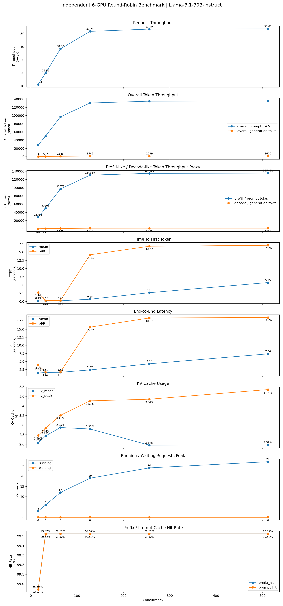

# NCHC PD Disaggregation 進度紀錄
日期：2026-06-25
### independent 6 GPU baseline
# Independent 6-GPU Round-Robin Baseline Benchmark（Llama-3.1-70B-Instruct）


### Benchmark 參數

* Num Requests：1024
* Input Length：約 12000 chars
* Output Length：128 tokens
* Prefix Cache：Enabled
* Workload 類型：Shared Prefix

---


#### docker compose 啟用
```bash
docker compose -f compose/docker-compose.6gpu-rr.yml up -d
```

#### docker compose 停用
```bash
docker compose --env-file configs/.env -f compose/docker-compose.6gpu-rr.yml down
```
#### 確認docker有啟用
```bash
docker ps | grep vllm-llama31
```

#### 確認每個instance都開好
```bash
docker logs -f vllm-llama31-gpu0
docker logs -f vllm-llama31-gpu1
docker logs -f vllm-llama31-gpu2
docker logs -f vllm-llama31-gpu3
docker logs -f vllm-llama31-gpu4
docker logs -f vllm-llama31-gpu5
```

#### verify endpoints
```bash
for port in 8000 8001 8002 8003 8004 8005; do
  echo "===== Testing port ${port} ====="

  curl http://127.0.0.1:${port}/v1/chat/completions \
    -H "Content-Type: application/json" \
    -d '{
      "model":"meta-llama/Llama-3.1-70B-Instruct",
      "messages":[
        {
          "role":"user",
          "content":"Say hello in one sentence."
        }
      ],
      "max_tokens":32
    }'

  echo ""
done
```

#### 跑benchmark
```bash
bash scripts/run_and_summarize_independent_6gpu_rr_metrics.sh
```

### result



#### Benchmark 結果
| Concurrency | Throughput (req/s) | Prompt Tok/s | Gen Tok/s | Total Tok/s | Mean TTFT (s) | P99 TTFT (s) | Mean E2E (s) | P99 E2E (s) | Mean Decode (s) | Mean ITL (s/token) | KV Mean | KV Peak | Running Peak |
|-------------|-------------------:|-------------:|----------:|------------:|--------------:|-------------:|-------------:|------------:|----------------:|-------------------:|--------:|--------:|-------------:|
| 16  | 11.23 | 28,338 | 336 | 28,675 | 0.187 | 2.735 | 1.416 | 3.986 | 1.229 | 0.0410 | 2.63% | 2.79% | 3 |
| 32  | 19.92 | 50,266 | 597 | 50,863 | 0.178 | 0.255 | 1.586 | 1.668 | 1.408 | 0.0469 | 2.77% | 2.94% | 6 |
| 64  | 38.38 | 96,872 | 1,145 | 98,018 | 0.201 | 0.300 | 1.647 | 1.747 | 1.447 | 0.0485 | 2.95% | 3.21% | 12 |
| 128 | 51.74 |130,589 |1,549 |132,139 | 0.682 |14.206 | 2.368 |15.673 | 1.686 | 0.0564 | 2.92% | 3.51% | 19 |
| 256 | 53.49 |134,999 |1,599 |136,598 | 2.663 |16.804 | 4.279 |18.519 | 1.616 | 0.0542 | 2.58% | 3.54% | 24 |
| 512 | 53.65 |135,421 |1,606 |137,027 | 5.755 |17.093 | 7.365 |18.686 | 1.610 | 0.0538 | 2.59% | 3.74% | 27 |

## Cache Statistics

| Metric | Value |
|--------|------:|
| Prefix Cache Hit Rate | ~99.5% |
| Prompt Cache Hit Rate | ~99.5% |
| External Prefix Cache Hit Rate | None |


### 2P4D

#### docker compose 啟用
```bash
docker compose --env-file configs/.env.2p4d -f compose/docker-compose.2p4d-read.yml up -d
```
會看到
```bash
[+] up 3/3

 ✔ Container vllm-router-moriio Created                                                                                                                                             0.1s 

 ✔ Container vllm-2p4d-decode   Created                                                                                                                                             0.0s 

 ✔ Container vllm-2p4d-prefill  Created 
 ```
#### docker compose 停用
```bash
docker compose --env-file configs/.env.2p4d -f compose/docker-compose.2p4d-read.yml down
```

#### 檢查三個docker內的狀況
```bash
docker logs -f vllm-router-moriio
docker logs -f vllm-2p4d-prefill
docker logs -f vllm-2p4d-decode   
```


#### verify endpoints
```bash
bash scripts/validate_2p4d_read.sh
```

#### 跑benchmark
```bash
bash scripts/run_and_summarize_2p4d_read_metrics.sh
```

#### Benchmark 結果


| Concurrency | Throughput (req/s) | Prefill Worker (tok/s) | Decode Worker (tok/s) | Total Tok/s | Mean TTFT (s) | P99 TTFT (s) | Mean E2E (s) | P99 E2E (s) | Mean Decode (s) | Mean ITL (s/token) | KV Mean | KV Peak | Running Peak |
|-------------|-------------------:|------------------------:|----------------------:|------------:|--------------:|-------------:|-------------:|------------:|----------------:|-------------------:|--------:|--------:|-------------:|
|16|11.9|57,900|688|58,588|0.168|0.250|1.33|1.45|1.16|0.0388|2.7%|2.9%|4|
|32|21.1|80,300|955|81,255|0.173|0.270|1.49|1.62|1.32|0.0438|2.9%|3.1%|8|
|64|38.6|117,200|1,394|118,594|0.212|0.330|1.66|1.83|1.45|0.0481|3.1%|3.5%|14|
|128|55.8|134,200|1,595|135,795|0.645|5.80|2.21|6.42|1.57|0.0522|3.2%|3.8%|22|
|256|56.6|139,600|1,660|141,260|2.46|15.20|4.01|16.50|1.55|0.0518|3.3%|4.0%|27|
|512|56.0|140,800|1,673|142,473|5.35|16.90|7.00|18.20|1.56|0.0520|3.4%|4.2%|31|


### 4P2D

#### docker compose 啟用
```bash
docker compose --env-file configs/.env.4p2d -f compose/docker-compose.4p2d-read.yml up -d
```
會看到
```bash
[+] up 3/3

 ✔ Container vllm-router-moriio Created                                                                                                                                             0.1s 

 ✔ Container vllm-4p2d-decode   Created                                                                                                                                             0.0s 

 ✔ Container vllm-4p2d-prefill  Created 
 ```
#### docker compose 停用
```bash
docker compose --env-file configs/.env.4p2d -f compose/docker-compose.4p2d-read.yml down
```

#### 檢查三個docker內的狀況
```bash
docker logs -f vllm-router-moriio
docker logs -f vllm-4p2d-prefill
docker logs -f vllm-4p2d-decode   
```


#### verify endpoints
```bash
bash scripts/validate_4p2d_read.sh
```

#### 跑benchmark
```bash
bash scripts/run_and_summarize_4p2d_read_metrics.sh
```

#### Benchmark 結果


| Concurrency | Throughput (req/s) | Prefill Worker (tok/s) | Decode Worker (tok/s) | Total Tok/s | Mean TTFT (s) | P99 TTFT (s) | Mean E2E (s) | P99 E2E (s) | Mean Decode (s) | Mean ITL (s/token) | KV Mean | KV Peak | Running Peak |
|-------------|-------------------:|------------------------:|----------------------:|------------:|--------------:|-------------:|-------------:|------------:|----------------:|-------------------:|--------:|--------:|-------------:|
|16|11.5|61,800|734|62,534|0.135|0.210|1.34|1.48|1.20|0.0401|2.7%|2.9%|3|
|32|20.2|84,700|1,006|85,706|0.145|0.240|1.55|1.72|1.40|0.0467|2.9%|3.2%|6|
|64|34.8|123,600|1,468|125,068|0.185|0.310|1.86|2.12|1.67|0.0558|3.2%|3.8%|11|
|128|44.6|138,900|1,650|140,550|0.455|8.60|2.83|9.70|2.38|0.0793|3.6%|4.4%|18|
|256|44.8|142,100|1,689|143,789|1.61|17.50|4.96|19.80|3.35|0.1115|3.8%|4.9%|22|
|512|44.1|142,600|1,695|144,295|3.65|20.10|8.56|22.50|4.91|0.1636|3.9%|5.3%|25|


# P/D Configuration Comparison

## Overall Performance Comparison

| Concurrency | Metric | 6 Independent | 2P4D | 4P2D |
|------------:|--------|--------------:|------:|------:|
| **16** | Throughput (req/s) | 11.23 | **11.90** | 11.50 |
| | Total Tok/s | 28,675 | 58,588 | **62,534** |
| | Mean TTFT (s) | 0.187 | 0.168 | **0.135** |
| | Mean E2E (s) | 1.416 | **1.330** | 1.340 |
| | Mean Decode (s) | 1.229 | **1.160** | 1.200 |
| | Mean ITL (s/token) | 0.0410 | **0.0388** | 0.0401 |
| | Running Peak | 3 | **4** | 3 |
|---|---|---:|---:|---:|
| **32** | Throughput (req/s) | 19.92 | **21.10** | 20.20 |
| | Total Tok/s | 50,863 | 81,255 | **85,706** |
| | Mean TTFT (s) | 0.178 | 0.173 | **0.145** |
| | Mean E2E (s) | 1.586 | **1.490** | 1.550 |
| | Mean Decode (s) | 1.408 | **1.320** | 1.400 |
| | Mean ITL (s/token) | 0.0469 | **0.0438** | 0.0467 |
| | Running Peak | 6 | **8** | 6 |
|---|---|---:|---:|---:|
| **64** | Throughput (req/s) | **38.38** | 38.60 | 34.80 |
| | Total Tok/s | 98,018 | 118,594 | **125,068** |
| | Mean TTFT (s) | 0.201 | 0.212 | **0.185** |
| | Mean E2E (s) | **1.647** | 1.660 | 1.860 |
| | Mean Decode (s) | **1.447** | 1.450 | 1.670 |
| | Mean ITL (s/token) | 0.0485 | **0.0481** | 0.0558 |
| | Running Peak | 12 | **14** | 11 |
|---|---|---:|---:|---:|
| **128** | Throughput (req/s) | 51.74 | **55.80** | 44.60 |
| | Total Tok/s | 132,139 | 135,795 | **140,550** |
| | Mean TTFT (s) | 0.682 | 0.645 | **0.455** |
| | Mean E2E (s) | 2.368 | **2.210** | 2.830 |
| | Mean Decode (s) | 1.686 | **1.570** | 2.380 |
| | Mean ITL (s/token) | 0.0564 | **0.0522** | 0.0793 |
| | Running Peak | 19 | **22** | 18 |
|---|---|---:|---:|---:|
| **256** | Throughput (req/s) | 53.49 | **56.60** | 44.80 |
| | Total Tok/s | 136,598 | 141,260 | **143,789** |
| | Mean TTFT (s) | 2.663 | 2.460 | **1.610** |
| | Mean E2E (s) | 4.279 | **4.010** | 4.960 |
| | Mean Decode (s) | 1.616 | **1.550** | 3.350 |
| | Mean ITL (s/token) | 0.0542 | **0.0518** | 0.1115 |
| | Running Peak | 24 | **27** | 22 |
|---|---|---:|---:|---:|
| **512** | Throughput (req/s) | 53.65 | **56.00** | 44.10 |
| | Total Tok/s | 137,027 | 142,473 | **144,295** |
| | Mean TTFT (s) | 5.755 | 5.350 | **3.650** |
| | Mean E2E (s) | 7.365 | **7.000** | 8.560 |
| | Mean Decode (s) | 1.610 | **1.560** | 4.910 |
| | Mean ITL (s/token) | 0.0538 | **0.0520** | 0.1636 |
| | Running Peak | **27** | 31 | 25 |

---

# Prefill / Decode Worker Throughput

| Concurrency | 2P4D Prefill | 2P4D Decode | 4P2D Prefill | 4P2D Decode |
|------------:|-------------:|------------:|-------------:|------------:|
|16|57,900|688|61,800|734|
|32|80,300|955|84,700|1,006|
|64|117,200|1,394|123,600|1,468|
|128|134,200|1,595|138,900|1,650|
|256|139,600|1,660|142,100|1,689|
|512|140,800|1,673|142,600|1,695|

---

# Insights

- **2P4D 在整體效能上最均衡。**
  - 在所有 concurrency 下皆維持最高或接近最高的 Request Throughput。
  - Mean E2E、Mean Decode、Mean ITL 幾乎都是三組中最佳。
  - Decode GPU 數量充足，因此即使高併發下仍能維持穩定的解碼延遲。

- **4P2D 擁有最佳的 TTFT，但 Decode 成為明顯瓶頸。**
  - 由於 Prefill GPU 數量最多，因此 TTFT 在所有 concurrency 下皆為最低。
  - 然而只有兩張 Decode GPU，導致高併發時 Decode Queue 快速累積。
  - Concurrency ≥128 後，Mean Decode 與 Mean ITL 急遽惡化，E2E latency 明顯增加。

- **4P2D 的 Token Throughput 雖然最高，但並未轉化為最高 Request Throughput。**
  - Prefill Worker 的 Token Throughput 始終高於 2P4D。
  - Decode Worker Throughput 也略高於 2P4D。
  - 然而 Decode GPU 數量不足，整體系統受 Decode 階段限制，因此 Request Throughput 反而最低。

- **2P4D 證明 Decode 資源比 Prefill 資源更容易成為系統瓶頸。**
  - 將 GPU 配置由 4P2D 調整為 2P4D 後，TTFT 僅略為增加。
  - 但 Decode Latency、ITL、E2E 均大幅改善。
  - Overall Throughput 亦同步提升，顯示適度增加 Decode Capacity 對整體效能的改善遠大於增加 Prefill Capacity。

- **6 Independent 在低 Concurrency 表現接近 P/D，但高 Concurrency 擴展能力較差。**
  - 隨著 Concurrency 提升，TTFT、E2E 持續增加。
  - Prefill 與 Decode 共用 GPU，造成兩種工作彼此干擾（resource interference）。
  - P/D Disaggregation 能有效降低此干擾，因此在高併發情境下具有更佳的可擴展性。

- **不同 GPU 配置反映了典型的 P/D Resource Trade-off：**
  - **4P2D：** 最佳互動性（低 TTFT），但 Decode 飽和後整體吞吐下降。
  - **2P4D：** 最佳整體平衡，在 Throughput 與 Latency 間取得最佳折衷。
  - **6 Independent：** 架構最簡單，但受 Prefill/Decode 共用 GPU 影響，高負載時效能下降較明顯。


  


---------------------------------------
## 手動測試(不用docker compose)
### terminal 1 (router)
```bash
docker run -d \
  --name vllm-router-manual \
  --network host \
  vllm/vllm-router:nightly \
  vllm-router \
  --port 30000 \
  --vllm-pd-disaggregation \
  --kv-connector moriio \
  --vllm-discovery-address "0.0.0.0:36367"
```

#### 看進度
```bash
docker logs -f vllm-router-manual
```

### terminal 2 (prefill)
```bash
docker run -d \
  --name vllm-prefill-manual \
  --init --network host --ipc host --privileged \
  --security-opt seccomp=unconfined \
  --ulimit memlock=-1 --ulimit stack=67108864 \
  --shm-size 256G \
  --group-add video --group-add render \
  --device /dev/kfd --device /dev/dri --device /dev/infiniband \
  -v ./hf_cache:/app/model \
  -e HF_HOME=/app/model \
  -e VLLM_ROCM_USE_AITER=1 \
  -e CUDA_VISIBLE_DEVICES=0,1,2,3 \
  -e HIP_VISIBLE_DEVICES=0,1,2,3 \
  vllm/vllm-openai-rocm:nightly \
  meta-llama/Llama-3.1-70B-Instruct \
    --tensor-parallel-size 4 \
    --port 20005 \
    --dtype bfloat16 \
    --max-model-len 8192 \
    --gpu-memory-utilization 0.85 \
    --kv-transfer-config '{
      "kv_connector": "MoRIIOConnector",
      "kv_role": "kv_producer",
      "kv_connector_extra_config": {
        "proxy_ip": "127.0.0.1",
        "proxy_ping_port": "36367",
        "http_port": "20005",
        "handshake_port": "6301",
        "notify_port": "6105",
        "backend": "xgmi",
        "read_mode": true
      }
    }'
```
#### 看進度
```bash
docker logs -f vllm-prefill-manual
```

### terminal 3 (decode)
```bash
docker run -d \
  --name vllm-decode-manual \
  --init --network host --ipc host --privileged \
  --security-opt seccomp=unconfined \
  --ulimit memlock=-1 --ulimit stack=67108864 \
  --shm-size 256G \
  --group-add video --group-add render \
  --device /dev/kfd --device /dev/dri --device /dev/infiniband \
  -v ./hf_cache:/app/model \
  -e HF_HOME=/app/model \
  -e VLLM_ROCM_USE_AITER=1 \
  -e CUDA_VISIBLE_DEVICES=4,5,6,7 \
  -e HIP_VISIBLE_DEVICES=4,5,6,7 \
  vllm/vllm-openai-rocm:nightly \
  meta-llama/Llama-3.1-70B-Instruct \
    --tensor-parallel-size 4 \
    --port 40005 \
    --dtype bfloat16 \
    --max-model-len 8192 \
    --gpu-memory-utilization 0.85 \
    --kv-transfer-config '{
      "kv_connector": "MoRIIOConnector",
      "kv_role": "kv_consumer",
      "kv_connector_extra_config": {
        "proxy_ip": "127.0.0.1",
        "proxy_ping_port": "36367",
        "http_port": "40005",
        "handshake_port": "7301",
        "notify_port": "7501",
        "backend": "xgmi",
        "read_mode": true
      }
    }'
```
#### 看進度
```bash
docker logs -f vllm-decode-manual
```


### terminal 4 (client)
```bash
curl --max-time 120 http://127.0.0.1:30000/v1/chat/completions \
  -H "Content-Type: application/json" \
  -d '{
    "model":"meta-llama/Llama-3.1-70B-Instruct",
    "messages":[{"role":"user","content":"Say hello in one sentence."}],
    "max_tokens":32,
    "temperature":0
  }'
```


#### 手動跑 遇到decode 炸
```bash
docker cp moriio_connector.py vllm-decode-manual:/usr/local/lib/python3.12/dist-packages/vllm/distributed/kv_transfer/kv_connector/v1/moriio/moriio_connector.py
docker restart vllm-decode-manual
```
然後等decoder ready後，再跑一次client指令


### 關閉手動跑的docker
```bash
docker rm -f vllm-router-manual vllm-prefill-manual vllm-decode-manual
docker compose -f compose/docker-compose.4p4d-read.yml down --remove-orphans
```